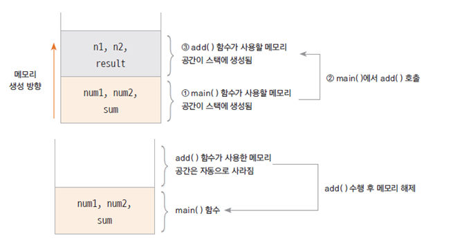

# 객체지향 프로그래밍
## 클래스
- 객체의 속성은 클래스의 멤머 변수(member variable)로 선언 함
- 객체를 정의 하고 -> 각 객체의 속성을 멤버 변수로 역할을 메서드로 구현하고 -> 각 객체간의 협력을 구현
- 클래스는 대문자로 시작하는것이 좋음
- java 파일 하나에 클래스는 여러 개가 있을 수 있지만, public 클래스는 하나이고, public 클래스와 .java 파일의 이름은 동일함
- camel notation 방식으로 명명

## 함수
- 구현된(정의된) 함수는 호출하여 사용하고 호출된 함수는 기능이 끝나면 제어가 반환됨
- 함수로 구현된 하나의 기능은 여러 곳에서 동일한 방식으로 호출되어 사용될 수 있음
```JAVA
public class FunctionTest {
	
	public static int addNum(int num1, int num2) {
		int result;
		result = num1 + num2;
		return result;
	}
	
	public static void sayHello(String greeting) {
		System.out.println(greeting);
	}
	
	public static int calcSum() {
		
		int sum = 0;
		int i;
		
		for(i = 0; i<=100; i++) {
			sum += i;
		}
		
		return sum;
	}

	public static void main(String[] args) {
		
		int n1 = 10;
		int n2 = 20;
		
		int total = addNum(n1, n2);
		
		sayHello("안녕하세요");
		int num = calcSum();
		
		System.out.println(total); // 30
		System.out.println(num);  // 5050
	}
}
```

### 함수호출과 스택 메모리
- 스택: 함수가 호출될때 "지역변수" 들이 사용하는 메모리
- 스택은 함수의 수행이 끝나면 자동으로 반환되는 메모리



## 메서드
- 객체의 기능을 구현하기 위해 **클래스 내부에 구현되는 함수**
- 멤버 함수 (member function)이라고도 함
- 메서드를 구현함으로써 객체의 기능이 구현 됨
- 메서드의 이름은 그 객체를 사용하는 객체(클라이언트)에 맞게 짓는것이 좋음 (getStudentName())

## 객체의 속성은 멤버 변수로, 객체의 기능은 메서드로 구현
```JAVA
// 학생 클래스 생성 및 메서드 구현
public class Student {
	
	public int studentID; // 이런 속성값들이 맴버변수
	public String studentName;  
	public String address;
	
    // 아래 두개의 함수가 메서드
	public void showStudentInfo() {
		System.out.println(studentName + "," + address);
	}
	
	public String getStudentName() {
		return studentName;
	}
}
```
```JAVA
// 학생 클래스의 객체(인스턴스)를 생성
public class StudentTest {

	public static void main(String[] args) {
		
		Student studentLee = new Student();
		studentLee.studentName = "이순신";
		studentLee.address = "서울";
		
		
		studentLee.showStudentInfo();
		
		Student studentKim = new Student();
		studentKim.studentName = "김유신";
		studentKim.address = "경주";
		
		studentKim.showStudentInfo();
		
		System.out.println(studentLee);
		System.out.println(studentKim);
	}

}
```

## 인스턴스 (instance)
- 클래스는 객체의 속성을 정의 하고, 기능을 구현하여 만들어 놓은 코드 상태
- 실제 클래스 기반으로 생성된 객체(인스턴스)는 각각 다른 멤버 변수 값을 가지게 됨
- 가령, 학생의 클래스에서 생성된 각각의 인스턴스는 각각 다른 이름, 학번, 학년등의 값을 가지게 됨
- new 키워드를 사용하여 인스턴스 생성

## 힙 메모리
- 생성된 인스턴스는 동적 메모리(heap memory) 에 할당됨
- C나 C++ 언어에서는 사용한 동적 메모리를 프로그래머가 해제 시켜야 함 ( free() 나 delete 이용)
- 자바에서 Gabage Collector 가 주기 적으로 사용하지 않는 메모리를 수거
- 하나의 클래스로 부터 여러개의 인스턴스가 생성되고 각각 다른 메모리 주소를 가지게 됨

## 생성자(constructor)
- 생성자 기본 문법 -> <class_name>([<argument_list]){[<statements]}
- 객체를 생성할 때 new 키워드와 함께 사용   - new Student();
- 생성자는 일반 함수처럼 기능을 호출하는 것이 아니고 객체를 생성하기 위해 new 와 함께 호출 됨
- 객체가 생성될 때 변수나 상수를 초기화 하거나 다른 초기화 기능을 수행하는 메서드를 호출 함
- 생성자는 반환 값이 없고, 클래스의 이름과 동일
- 대부분의 생성자는 외부에서 접근 가능하지만, 필요에 의해 private 으로 선언되는 경우도 있음
  - private의 경우는 외부에선 접근할 수 없음

## 기본 생성자 (default constructor)
- 클래스에는 반드시 적어도 하나 이상의 생성자가 존재
- 클래스에 생성자를 직접 구현하지 않아도 new 키워드와 함께 생성자를 호출할 수 있음
  - 클래스에 생성자가 하나도 없는 경우 컴파일러가 생성자 코드를 넣어 주기 때문이다 -> public Student(){}
- 매개 변수가 없음, 구현부가 없음

```JAVA
public class Student {

	public int studentNumber;
	public String studentName;
	public int grade;
	
    // 이렇게 생성자를 직접 생성해주면, 컴파일러가 자동으로 생성자를 만들지 않음
	public Student(int studentNumber, String studentName, int grade) {
		this.studentNumber = studentNumber; // this를 사용하여 맴버변수임을 명시해줘야함
		this.studentName = studentName;
		this.grade = grade;
	}
	
	public String showStudentInfo() {
		return studentName + "학생의 학번은 " + studentNumber + "이고, " + grade + "학년 입니다.";
	}
}
```
```JAVA
public class StudentTest {

	public static void main(String[] args) {

		//Student studentLee = new Student();
		
		Student studentLee = new Student(12345, "Lee", 3);
		
		String data = studentLee.showStudentInfo();
		System.out.println(data); // lee학생의학번은 12345이고 3학년입니다
	}

}
```
## 생성자 오버로딩 (overloading)
- 생성자를 여러개 구현해서 사용할 수 있음
- 클래스에 생성자를 따로 구현하면 기본 생성자 (default constructor)는 제공되지 않음
- 생성자를 호출하는 코드(client)에서 여러 생성자 중 필요한 생성자를 선택하여 호출하고 사용할 수 있음
```JAVA
public class UserInfo {

	public String userId;
	public String userPassWord;
	public String userName;
	public String userAddress;
	public String phoneNumber;
	
	public UserInfo(){}
	
    // this를 통해 맴버변수 명시하는것이 매우중요!
	public UserInfo(String userId, String userPassWord, String userName) {
		this.userId = userId;
		this.userPassWord = userPassWord;
		this.userName = userName;
	}
	
	public String showUserInfo() {
		return "고객님의 아이디는 " + userId + "이고, 등록된 이름은 " + userName + "입니다."; 
	}
}
```
```JAVA
public class UserInfoTest {

	public static void main(String[] args) {

        // 기본생성자로 직접 다 입력하여 인스턴스 생성
		UserInfo userLee = new UserInfo();
		userLee.userId = "a12345";
		userLee.userPassWord = "zxcvbn12345";
		userLee.userName = "Lee";
		userLee.phoneNumber = "01034556699";
		userLee.userAddress = "Seoul, Korea";
		
		System.out.println(userLee.showUserInfo());
		
        // 파라미터를 입력받는 생성자로 바로 인스턴스생성
		UserInfo userKim = new UserInfo("b12345", "09876mnbvc", "Kim");
		System.out.println(userKim.showUserInfo());
	}
}

```