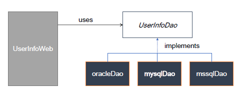

# 인터페이스(interface)
- 모든 메서드가 추상 메서드로 자동 선언됨 public abstract
- 모든 변수는 상수로 선언됨 public static final
- 자바 8 부터 디폴트 메서드(default method)와 정적 메서드(static method) 기능의 제공으로 일부 구현 코드가 있음
```JAVA
interface 인터페이스 이름{

    public static final float pi = 3.14F;
    public void makeSomething();
}
```

## 인터페이스 정의와 구현
- 이전에 배운 상속의 개념과는 다르게 인터페이스는 코드내부에 구현코드가 따로 존재하지않고, **"다른 클래스가 인터페이스를 구현시키는"** 메커니즘이다
```JAVA
// 인터페이스 생성
public interface Calc {

	double PI = 3.14;
	int ERROR = -99999999;
	
	int add(int num1, int num2);
	int substract(int num1, int num2);
	int times(int num1, int num2);
	int divide(int num1, int num2);
}
```
```JAVA
// 인터페이스의 추상메서드를 두개 구현시킨 추상클래스 생성
public abstract class Calculator implements Calc{

	@Override
	public int add(int num1, int num2) {
		return num1 + num2;
	}

	@Override
	public int substract(int num1, int num2) {
		return num1 - num2;
	}
}
```
```JAVA
// 남은 두개의 메서드를 구현한 클래스 생성
public class CompleteCalc extends Calculator{
	
	@Override
	public int times(int num1, int num2) {
		return num1 * num2;
	}

	@Override
	public int divide(int num1, int num2) {
		if( num2 == 0 )
			return ERROR;
		else 
			return num1 / num2;
	}
	
	public void showInfo() {
		System.out.println("모두 구현하였습니다.");
	}
}
```
```JAVA
// test
public class CalculatorTest {

	public static void main(String[] args) {
		Calc calc = new CompleteCalc();
		int num1 = 10;
		int num2 = 2;
		
		System.out.println(num1 + "+" + num2 + "=" + calc.add(num1, num2)); // 10 + 2 = 12
		System.out.println(num1 + "-" + num2 + "=" +calc.substract(num1, num2)); // 10 - 2 = 8
		System.out.println(num1 + "*" + num2 + "=" +calc.times(num1, num2)); // 10 * 2 = 20
		System.out.println(num1 + "/" + num2 + "=" +calc.divide(num1, num2)); // 10 / 2 = 5
	}
}
```

## 인터페이스의 구현과 형 변환
- 인터페이스를 구현한 클래스는 인터페이스 형으로 선언한 변수로 형 변환 할 수 있음 (타입상속)
  - Calc calc = new CompleteCalc();
- 상속에서의 형 변환과 동일한 의미
- 클래스 상속과 달리 구현 코드가 없으므로 여러 인터페이스를 구현할 수 있음 ( cf. extends)
- 형 변환되는 경우 인터페이스에 선언된 메서드만을 사용가능함


## 인터페이스를 쓰는 이유
- 클래스나 프로그램이 제공하는 기능을 명시적으로 선언
- 일종의 클라이언트 코드와의 약속이며 클래스나 프로그램이 제공하는 명세(specification)
- 클라이언트 프로그램은 인터페이스에 선언된 메서드 명세만 보고 이를 구현한 클래스를 사용할 수 있음
- 어떤 객체가 하나의 인터페이스 타입이라는 것은 그 인터페이스가 제공하는 모든 메서드를 구현했다는 의미
- 인터페이스를 구현한 다양한 객체를 사용할수있다 - 다형성
  - JDBC 인터페이스(자바에서 connection을 생성해서 DB와 연결)


## 인터페이스와 다형성과 dao구현
- 하나의 인터페이스를 여러 객체가 구현하게 되면 클라이언트 프로그램은 인터페이스의 메서드를 활용하여 여러 객체의 구현을 사용할 수 있음 ( 다형성)
- DB에 회원 정보를 넣는 dao(data access object)를 여러 DB 제품이 지원될 수 있게 구현함
- 환경파일(db.properties) 에서 database의 종류에 대한 정보를 읽고 그 정보에 맞게 dao 인스턴스를 생성하여 실행될 수 있게 함
- source hierachy(계층구도)
  - 하나의 인터페이스로 오라클과 mySQL 을 같이 관리하는 예시


## private 메서드(자바9 이후)
- 인터페이스를 구현한 클래스에서 사용하거나 재정의 할 수 없음
- 인터페이스 내부에서만 사용하기 위해 구현하는 메서드
- default 메서드나 static 메서드에서 사용함
```JAVA
private void myMethod() {
	System.out.println("private method");
}

private static void mystaticMethod() {
	System.out.println("private static method");
}
```

## 디폴트 메서드(자바8 이후)
- 구현을 가지는 메서드, 인터페이스를 구현하는 클래스들에서 공통으로 사용할 수 있는 기본 메서드로 default 키워드 사용
- 인터페이스를 구현한 클래스의 인스턴스가 생성 되어야 사용 가능함
```JAVA
default void description() {
	System.out.println("계산기를 구현합니다.");
	// private 메서드 사용
    myMethod();
}

// 구현하는 클래스에서 재정의 할 수 있다
@Override
public void description() {
	System.out.println("CompleteCalc에서 재정의한 default 메서드");
	//super.description(); // overriding 전 메서드
}
```

## 정적메서드(자바8 이후)
- 인스턴스 생성과 상관 없이 인터페이스 타입으로 사용할 수 있는 메서드
```JAVA
static int total(int[] arr) {
	int total = 0;
		
	for(int i: arr) {
		total += i;
	}
    // private 메서드 사용
	mystaticMethod();
	return total;
}
```