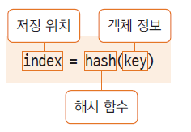

# Object class (최상위 클래스)
## java.lang 패키지
- 프로그래밍시 import 하지 않아도 자동으로 imort됨
- import.java.lang.*;
- 많이 사용하는 기본 클래스들이 속한 패키지
- String, Integer, System...

## 모든 클래스는 Object 클래스를 상속 받는다
- java.lang.Object 클래스(모든 클래스의 최상위 클래스)
- 모든 클래스는 Object에서 상속받고, Object 클래스의 메서드 중 일부는 재정의해서 사용할 수 있음(재정의 불가능한 final로 선언된 메서드도 존재)
- 컴파일러가 extends Object를 추가함
  - class Student => class Student extends Object

## toString() 메서드
- 객체의 정보를 String으로 바꾸어서 사용할 때 쓰임
- String이나 Integer 클래스는 이미 재정의 되어 있음
```JAVA
// toString()메서드 재정의 예시
class Book{
	
	private String title;
	private String author;
	
	public Book(String title, String author) {
		this.title = title;
		this.author = author;
	}
	
    // 재정의
    @override
	public String toString() {
		return title + "," + author;
	}
	
}

public class BookTest {

	public static void main(String[] args) {

		Book book = new Book("데미안", "헤르만 헤세");
		
		System.out.println(book); // 데미안, 헤르만헤세
        // 만약 재정의하지않았다면 book인스턴스의 주소값이 나옴
	}
}
```
## equals() 메서드
- 두 인스턴스의 주소 값을 비교하여 true/false를 반환
- 재정의 하여 두 인스턴스가 논리적으로 동일함의 여부를 구현함
  - 논리적으로 동일하다는것은 참조변수가 같다, 즉 동일한 힙메모리에 위치한다는 의미
- 인스턴스가 메모리상으로 다르더라도 논리적으로 동일한 경우 true를 반환하도록 재정의 할 수 있음 ("이름이 다르더라도 주민번호가 같다면 동일인이다" 라고 해야하는경우에 재정의)

## hashCode() 메서드
- hashCode()는 인스턴스의 저장 주소를 반환함
- 힙메모리에 인스턴스가 저장되는 방식이 hash 방식
- hash : 정보를 저장, 검색하는 자료구조
- 자료의 특정 값(키 값)에 대한 저장 위치를 반환해주는 해시 함수를 사용


- 두 인스턴스가 같다는 것은?  
  두 인스턴스에 대한 equals()의 반환 값이 true -> 동일한 hashCode() 값을 반환
- 논리적으로 동일함을 위해 equals() 메서드를 재정의 하였다면 hashCode()메서드도 재정의 하여 동일한 hashCode 값이 반환되도록 한다(즉 equals와 hashcode는 쌍으로 쓰이는경우가 많다)

```JAVA
// Student.java
public class Student {

	private int studentId;
	private String studentName;

	public Student(int studentId, String studentName)
	{
		this.studentId = studentId;
		this.studentName = studentName;
	}
	
    // 메모리주소는 다르지만 논리적으로 같다면(이경우는 학번이같다면) true를 반환하도록하는 equal()
	public boolean equals(Object obj) {
		if( obj instanceof Student) {
			Student std = (Student)obj; // obj를 student로 다운캐스팅
			if(this.studentId == std.studentId )
				return true;
			else return false;
		}
		return false;
		
	}
    // 학번이같다면 메모리주소가 다르더라도 같은 hashcode값을 반환하도록 재정의
	@Override
	public int hashCode() {
		return studentId;
	}
}
```
```JAVA
// EqualTest.java
public class EqualTest {

	public static void main(String[] args) {
		Student Lee = new Student(100, "Lee");
		Student Lee2 = Lee;
		Student Shun = new Student(100, "Lee");
		
		System.out.println(Lee == Shun); // false 메모리값은 다름
		System.out.println(Lee.equals(Shun)); // true
		System.out.println(Lee.hashCode()); // 100
		System.out.println(Shun.hashCode()); // 100
		
		Integer i1 = new Integer(100);
		Integer i2 = new Integer(100);
		
		System.out.println(i1.equals(i2)); // true
		System.out.println(i1.hashCode()); // 100
		System.out.println(i2.hashCode()); // 100

		// 만약 오버라이딩되지않은 진짜 해쉬코드를 보고싶다면 확인가능
		System.out.println(System.identityHashCode(i1)); // 1159190947
		System.out.println(System.identityHashCode(i2)); // 925858445
	}
}
```

## clone() 메서드
- 객체의 원본을 복제하는데 사용하는 메서드(생성자는 초기화해서 초기값을 가지고 생성하는것이고 클론은 인스턴스상태를 그대로 복제하는것)
- 생성과정의 복잡한 과정을 반복하지 않고 복제 할 수 있음
- clone()메서드를 사용하면 객체의 정보(멤버 변수 값등...)가 동일한 또 다른 인스턴스가 생성되는 것이므로, 객체 지향 프로그램에서의 정보 은닉, 객체 보호의 관점에서 위배될 수 있음
- 해당 클래스의 clone() 메서드의 사용을 허용한다는 의미로 cloneable 인터페이스를 명시해 줘야함
```JAVA
// Student.java
public class Student implements Cloneable{

    // 위의 student와 동일
    .......
	@Override
	protected Object clone() throws CloneNotSupportedException {
		// clone으로 간단하게 복제가능
		return super.clone();
	}
}
```
```JAVA
// EqualTest.java
    Student Lee3 = (Student)Lee.clone();
	System.out.println(System.identityHashCode(Lee));
	System.out.println(System.identityHashCode(Lee3));	
```		
