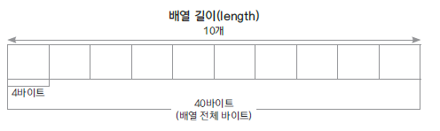
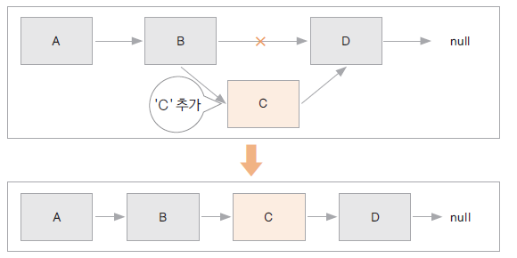
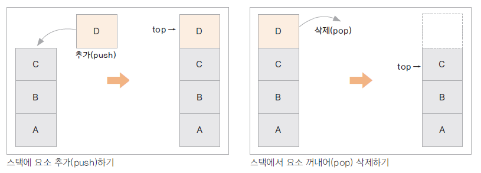
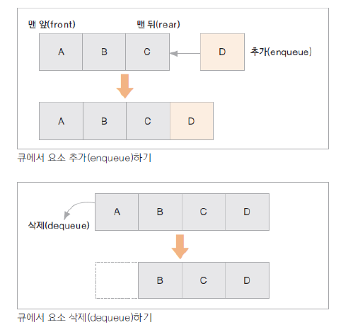
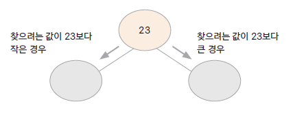
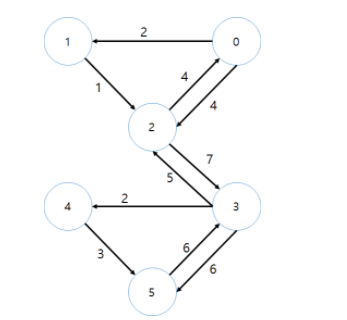
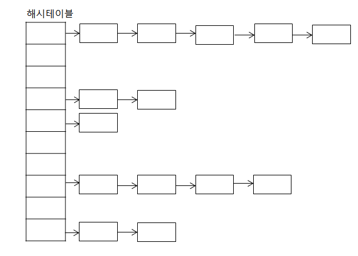

# 자료구조 (Data Structure)
## 배열 (Array)
- 선형으로 자료를 관리, 정해진 크기의 메모리를 **"먼저 할당받아서"** 사용하고, 자료의 물리적 위치와 논리적 위치가 같음( O(n) )  

## 연결 리스트 (LinkedList)
- 선형으로 자료를 관리, 자료가 **"추가될 때마다 메모리를 할당"** 받고, 자료는 링크로 연결됨. 자료의 물리적 위치와 논리적 위치가 다를 수 있음
- 배열보다 추가 삭제 수행속도가 빠르다( 추가:O(1) 검색:O(n) )  

## 스택 (Stack) 
- 가장 나중에 입력 된 자료가 가장 먼저 출력되는 자료 구조 (Last In First OUt)  

## 큐 (Queue) 
- 가장 먼저 입력 된 자료가 가장 먼저 출력되는 자료 구조 (First In First Out)  

## 트리 (Tree)
- 부모 노드와 자식 노드간의 연결로 이루어진 자료 구조
- 이진 트리 (binary tree) : 부모노드에 자식노드가 두 개 이하인 트리
  - 이진 검색 트리 (binary search tree)
  - 찾으려는값이 노드보다 크다면 오른쪽 작다면 왼쪽으로가서 찾는검색법
  - Max heap : 부모 노드는 자식 노드보다 항상 크거나 같은 값을 갖는 경우
  - Min heap : 부모 노드는 자식 노드보다 항상 작거나 같은 값을 갖는 경우  

## 그래프 (Graph)
- 정점과 간선들의 유한 집합 G = (V,E)
- 정점(vertex) : 여러 특성을 가지는 객체, 노드(node)
- 간선(edge) : 이 객체들을 연결 관계를 나타냄. 링크(link)
- 간선은 방향성이 있는 경우와 없는 경우가 있음
- 그래프를 구현하는 방법 : 인접 행렬(adjacency matrix), 인접 리스트(adjacency list)
- 그래프를 탐색하는 방법 : BFS(bread first search), DFS(depth first search)

## 해싱 (Hashing)
- 자료 검색을 위한 자료 구조
- 키(key)에 대한 자료를 검색하기 위한 사전(dictionary) 개념의 자료 구조
  - key는 유일하고 이에 대한 value를 쌍으로 저장
- index = h(key) : 해시 함수가 key에 대한 인덱스를 반환해줌 해당
- 인덱스 위치에 자료를 저장하거나 검색하게 됨
- 해시 함수에 의해 인덱스 연산이 산술적으로 가능 O(1)
- 저장되는 메모리 구조를 해시테이블이라 함
- jdk 클래스 : HashMap, Properties
- 해시테이블과 체이닝  
.png)  
