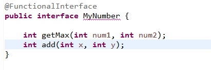

# 02. 람다식(Lambda expression)
## 함수형 프로그래밍과 람다식 (Java8 이후)
- 자바는 객체 지향 프로그래밍 : 기능을 수행하긴 위해서는 객체를 만들고 그 객체 내부에 멤버 변수를 선언하고 기능을 수행하는 메서드를 구현
- 자바 8부터 함수형 프로그래밍 방식을 지원하고 이를 람다식이라 함
- 함수의 구현과 호출만으로 프로그래밍이 수행되는 방식
- 함수형 프로그래밍(Functional Programming: FP) 
```
함수형 프로그래밍은 순수함수(pure function)를 구현하고 호출함으로써 외부 자료에 부수적인 영향(side effect)를 주지 않도록 구현하는 방식이다.
순수 함수란 매개변수만을 사용하여 만드는 함수이며 함수 내부에서 함수 외부에 있는 변수를 사용하지 않기때문에 함수가 수행되더라도 외부에는 영향을 주지 않는다.
함수를 기반으로 하는 프로그래밍이고 입력받는 자료 이외에 외부 자료를 사용하지 않아 여려 자료가 동시에 수행되는 병렬처리가 가능하다.
함수형 프로그래밍은 함수의 기능이 자료에 독립적이다. 그래서 동일한 자료에 대해 동일한 결과를 보장하고, 다양한 자료에 대해 같은 기능을 수행할 수 있다. 
```
<br><br>

## 람다식 문법
- 익명 함수 만들기
- 매개 변수와 매개변수를 이용한 실행문 (매개변수) -> {실행문;}
```java
// 두 수를 입력 받아 더하는 add() 함수 예
int add(int x, int y){

    return x+y;
}

// 람다식으로 표현
(int x, int y) -> {return x+y;}

// 매개 변수가 하나인 경우 자료형과 괄호 생략가능
str->{System.out.println(str);}

// 매개변수가 두 개이상인 경우 괄호를 생략할 수 없음
x, y -> {System.out.println(x+y);}  //오류

// 실행문이 한 문장인 경우 중괄호 생략 가능
str-> System.out.println(str);

// 실행문이 한 문장이라도 return문(반환문)은 중괄호를 생략할 수 없음
str-> return str.length();  //오류

// 실행문이 한 문장의 반환문인 경우엔 return과 중괄호를 모두 생략
(x, y) -> x+y;
str -> str.length;
```

## 함수형 인터페이스 선언하기
- 람다식을 선언하기 위한 인터페이스
- 익명 함수와 매개 변수만으로 구현되므로 인터페이스는 단 하나의 메서드만을 선언해야함 

- @FunctionalInterface 애노테이션(annotation)
  - 함수형 인터페이스라는 의미로 내부에 두개이상의 메서드를 선언하면 에러남(max add 두개를 선언하여 error발생)  
  

```java
// 람다식 구현과 호출
public class TestMyNumber {

	public static void main(String[] args) {
		MyNumber max = (x, y)->(x>= y)? x:y; // 람다식을 인터페이스 자료형 max 변수에 대입

		System.out.println(max.getMax(10, 20));// 인터페이스 자료형 변수로 함수 호출
	}
}
```
<br><br>

## 객체 지향 프로그래밍과 람다식 비교
- 문자열 두 개를 연결하여 출력하는 예제를 두 가지 방식으로 구현
```java
// 인터페이스 선언
public interface StringConcat {
	
	public void makeString(String s1, String s2);

}
```
<br><br>

- 객체 지향 프로그래밍으로 구현하기
```java
// 인터페이스를 구현한 클래스 만들기
public class StringConCatImpl implements StringConcat{

	@Override
	public void makeString(String s1, String s2) {
		System.out.println( s1 + "," + s2 );
	}
}
```
```java
// 클래스를 생성하고 메서드 호출하기
public class TestStringConcat {

	public static void main(String[] args) {

		String s1 = "Hello";
		String s2 = "World";
		StringConCatImpl concat1 = new StringConCatImpl();
		concat1.makeString(s1, s2);
    }
}
```
<br><br>

- 람다식으로 구현하기
```java
StringConcat concat2 = (s, v)->System.out.println(s + "," + v ); //System.out.println(i);
concat2.makeString(s1, s2);
```

## 익명 객체를 생성하는 람다식
- 자바에서는 객체 없이 메서드가 호출 될 수 없음
- 람다식을 구현하면 익명 내부 클래스가 만들어지고, 이를 통해 익명 객체가 생성됨
```java
StringConcat concat3 = new StringConcat() {
			
	@Override
	public void makeString(String s1, String s2) {
			
		System.out.println( s1 + "," + s2 );
	}
};
		
concat3.makeString(s1, s2);
```
- 익명 내부 클래스에서와 마찬가지로 람다식 내부에서 에서도 외부에 있는 지역 변수의 값을 변경하면 오류가 발생함
<br><br>

## 함수를 변수처럼 사용하는 람다식

변수는...
	
	특정 자료형으로 변수를 선언 한 후 값을 대입함   int a = 10;

	매개 변수로 전달하여 사용함 		int add(int x, int y)

	메서드의 반환 값으로 반환 하기		return num;


- 인터페이스형 변수에 람다식 대입하기
```java
// 함수형 인터페이스
interface PrintString{
	
	void showString(String str);
}
```
```java
PrintString lambdaStr = s->System.out.println(s);  //람다식을 변수에 대입
lambdaStr.showString("hello lambda_1");
```
<br><br>

- 매개변수로 전달하는 람다식
```java
showMyString(lambdaStr); 

public static void showMyString(PrintString p) {
	p.showString("hello lambda_2");
}
```
<br><br>

- 반환 값으로 쓰이는 람다식
```java
public static PrintString returnString() {         //반환 값으로 사용
		return s->System.out.println(s + "world");
}


PrintString reStr = returnString();  
reStr.showString("hello ");
```
