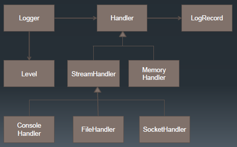

# 오류 로그를 남기기 
## logging - java.util.logging.Logger 활용
- 시스템 운영에 대한 기록
- 오류가 발생 했을 때 그 오류에 대한 기록을 남겨 디버깅을 용이하게 함
- 로그 파일에 기록하는 코드를 추가하여 필요한 정보가 로그로 남을 수 있도록 한다
- 디버깅, 시스템 에러 추적, 성능, 문제점 향상들을 위해 사용
- 어느정도까지 로그를 남길 것인가?
  - 너무 적은 로그 : 정확한 시스템의 상황을 파악하기 어려움
  - 너무 많은 로그 : 빈번한 file I/O의 오버헤드와 로그 파일의 백업 문제등...

## java.util.logging
- 자바에서 기본적으로 제공되는 log package
- 파일이나 콘솔에 로그 내용을 출력할 수 있음
- jre/lib/logging.properties 파일을 편집하여 로그의 출력방식 로그 레벨을 변경 할 수 있음
- logging 패키지에서 제공하는 로그 레벨은 severe, warning, info, config, fine, finer, finest 임
- 오픈소스로는 log4j를 많이 사용하고 있음



## Logger 만들기
```
시나리오
1. 학생 정보 시스템에 로그를 기록하도록 한다.
2. 학생의 이름에 오류가 있는 경우 예외 처리를 하고 예외 상황을 로그로 남긴다.
3. 학생의 이름은 null 이거나 중간에 space가 3개 이상인 경우 오류가 발생한다.

구현하기
1. Logger 인스턴스를 생성한다.
2. 로그를 남기기 위한 FileHandler를 생성한다.
3. FileHandler의 level을 지정하고
4. Logger에 생성된 addHandler()메서드로 FileHandler를 추가한다.
```

```java
// MyLogger.java
public class MyLogger {
	
	Logger logger = Logger.getLogger("mylogger");
	private static MyLogger instance = new MyLogger();
	
	public static final String errorLog = "log.txt";
	public static final String warningLog = "warning.txt";
	public static final String fineLog = "fine.txt";
	
	private FileHandler logFile = null;
	private FileHandler warningFile = null;
	private FileHandler fineFile = null;

	private MyLogger(){
	
			try {
				logFile = new FileHandler(errorLog, true);
				warningFile = new FileHandler(warningLog, true);
				fineFile = new FileHandler(fineLog, true);
				
			} catch (SecurityException e) {
				// TODO Auto-generated catch block
				e.printStackTrace();
			} catch (IOException e) {
				// TODO Auto-generated catch block
				e.printStackTrace();
			}
	
			logFile.setFormatter(new SimpleFormatter());
			warningFile.setFormatter(new SimpleFormatter());
			fineFile.setFormatter(new SimpleFormatter());
			
			logger.setLevel(Level.ALL);
			fineFile.setLevel(Level.FINE);
			warningFile.setLevel(Level.WARNING);
			
			logger.addHandler(logFile);
			logger.addHandler(warningFile);
			logger.addHandler(fineFile);
	}	
	
	
	public static MyLogger getLogger(){
		return instance;
	}

	
	public void log(String msg){
		
		logger.finest(msg);
		logger.finer(msg);
		logger.fine(msg);
		logger.config(msg);
		logger.info(msg);
		logger.warning(msg);
		logger.severe(msg);
		
	}
	
	public void fine(String msg){
		logger.fine(msg);
	}
	
	public void warning(String msg){
		logger.warning(msg);
	}
}
```
<br>

```java
// LoggerTest.java
public class LoggerTest {

	public static void main(String[] args) {

		MyLogger myLogger = MyLogger.getLogger();
		
		myLogger.log("test");
	}

}
```
<br>

```java
// StudentNameFormatException.java
public class StudentNameFormatException extends IllegalArgumentException{

	public StudentNameFormatException(String message){
		super(message);
	}
}
```
<br>

```java
// Student.java
public class Student {

	private String studentName;
	MyLogger myLogger = MyLogger.getLogger();
	
	public Student(String studentName){

		if(studentName == null){
		
			throw new StudentNameFormatException("name must not be null");
		}
		if( studentName.split(" ").length > 3)
			throw new StudentNameFormatException("이름이 너무 길어요");
		
		this.studentName = studentName;
	}

	
	public String getStudentName() {
		
		myLogger.fine("begin getStudentName()");
		
		return studentName;
	}
}
```
<br>

```java
// StudentTest.java
public class StudentTest {
	
	public static void main(String[] args) {
	
		MyLogger myLogger = MyLogger.getLogger();
		
		String name = null;
		try{
			Student student = new Student(name);
			
		}catch( StudentNameFormatException e ){
			myLogger.warning(e.getMessage());
		}
		
		try{
			Student student = new Student("Edward Jon Kim Test");
		}catch ( StudentNameFormatException e){
			myLogger.warning(e.getMessage());
		}
		
		Student student = new Student("James");
	}
	
}
```
