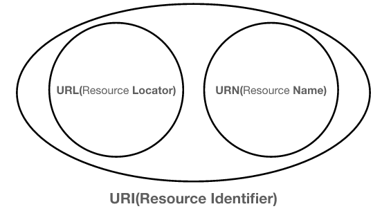
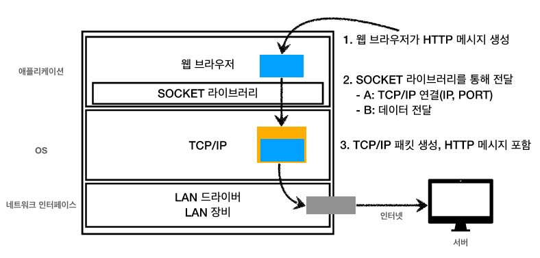

# 인터넷 네트워크

기본적으로 클라이언트와 서버는 인터넷으로 연결되있고  

인터넷 프로토콜 스택은 4계층으로 나눠져 있다.  
- 애플리케이션 (HTTP, FTP)
- 전송 (TCP, UDP)
- 인터넷 (IP)
- 네트워크 인터페이스 (랜카드, 랜드라이버)  

## IP (인터넷 프로토콜)
IP를 활용하면 지정한 주소로 원하는 정보를 패킷(Packet) 단위로 보낼 수 있다.  

IP패킷 내부에는  
[출발지IP, 목적지IP, 내용]  
세가지를 담아서 네트워크 내부의 노드를 따라 이동한다.  

하지만 패킷만 활용한 IP프로토콜 방식으로는 IP가 중복되거나 패킷을 받을 대상이 없거나 중간에 패킷이 사라지는 등의 다양한 문제점을 극복할 수 없다.  

## TCP (Transmission Control Protocol)
IP 패킷의 한계를 극복하기위해 TCP 세그먼트를 추가한 방법이 TCP/IP 패킷이다.  
TCP 세그먼트에는 출발지포트, 목적지포트, 전송제어, 순서, 검증정보 등의 다양한 정보를 추가로 담고있다.  

TCP 는 전송 제어 프로토콜로 다양한 특징을 가지고 있다.  

1. TCP 3way handshake : 클라이언트와 서버 양쪽에서 SYN + ACK 를 세번 주고 받으며 최종적으로 데이터를 전송한다.
2. TCP 내부의 전송정보, 순서등을 포함하기 때문에 데이터의 전달 순서를 보장받을 수 있다.
3. 데이터의 전달이 보증된다.

## UCP (User Datagram Protocol)
사용자 데이터그램 프로토콜로 실질적 기능은 거의 없다.  
데이터 전달 및 순서는 보장되지 않지만 단순하고 빠르다.  
IP에 포트, 체크섬을 추가한 형태이고 애플리케이션에서의 추가작업이 필요하다.  

사실상 TCP는 고정된 상태이고 UCP는 기능이 고정된게 아니라서  
최근 최적화과정은 UCP를 토대로 이뤄진다.

## PORT
하나의 클라이언트가 여러개의 서버와 통신해야할때 서버들에서 들어오는 패킷정보를 구분하기가 힘들다.  
이때 같은 IP 내에서 프로세스를 구분해주는것이 PORT의 역할이다.  
(예를들어 게임서버에서 오는 패킷은 8090포트로만 받고, 웹 브라우저에서 오는 패킷은 8080으로만 받자 라고 정해두는것이다)  

## URI (Uniform Resource Identifier)
URI 는 로케이터, 이름 또는 둘 다를 추가로 분류되고 통상적으로 URI == URL을 의미한다.    
  

- URL 기본형태  
scheme://[userinfo@]host[:port][/path][?query][#fragment]

scheme : 일반적으로 프로토콜 사용(http(80포트), https(443포트), ftp)  
userinfo@ : 보안에 사용되며 거의 쓰지않음
Path : 리소스 경로, 계층적 구조를 입력  
query : key,value 형태로 구성되어있고 쿼리파라미터,쿼리스트링 으로 불림  
fragment : html내부 북마크에 사용하고 서버에 전송되는 내용은 아님  

## 웹 브라우저 요청 흐름
  

1. 클라이언트가 URL을 입력하면 웹브라우저가 DNS(IP주소 검색) + PORT 정보를 확인한다
2. 정보를 기반으로 웹 브라우저가 HTTP 요청메세지를 생성한다
3. 소켓 라이브러리를 통해 서버에 데이터를 전달
4. 서버는 TCP/IP는 버리고 내부의 HTTP 정보만 처리한다
5. 서버에서 HTTP 응답 메세지를 만들어서 TCP/IP로 감싸고 다시 웹브라우저에 보낸다
6. 웹 브라우저가 내부의 HTTP 내용을 랜더링해서 화면에 띄우면 클라이언트가 볼 수 있다

