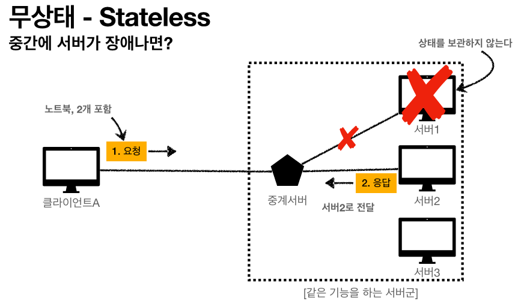
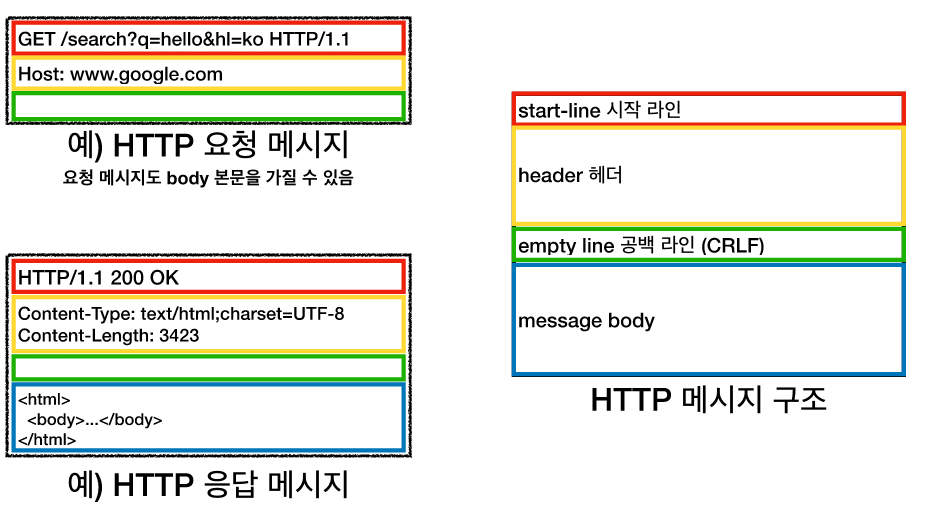
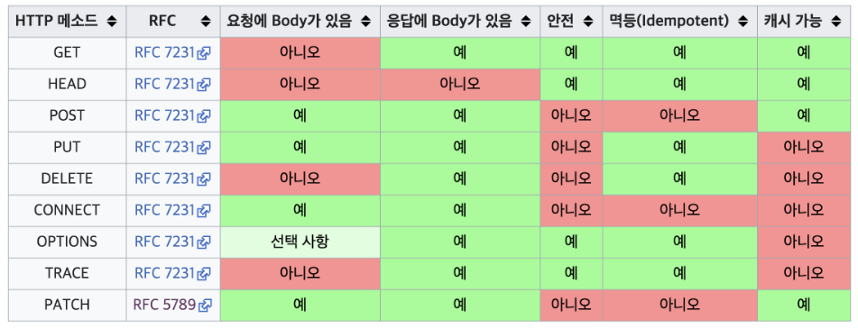

# HTTP (HyperText Transfer Protocol)
현재 HTTP 메세지에 거의 모든 형태의 데이터를 저장해서 전송한다.  
HTTP/1.1은 TCP 에서, HTTP/3 은 UDP 에서 작동한다.  

 

## 클라이언트 서버 구조
- Request Response 구조
- 클라가 요청 보내고 응답을 기다림
- 서버가 요청에대한 결과를 만들어 응답

 

## 무상태 프로토콜 (Stateless)
서버가 클라 상태를 보존하지 않기 때문에 서버의 무한 증설이 가능하다.  
즉 한번의 요청에 모든 데이터를 한번에 넘겨주기 때문에 서버 변경이 자유롭고 기존 서버가 장애나도 바로 대처할 수 있다.  
이것을 스케일 아웃 (수평 확장 유리)이라 한다.  
  

 

하지만 모든 내용을 무상태로 설계하기에는 불가능한 경우가 훨씬 많다.  
그래서 브라우저의 쿠키와 세션을 같이 사용하여 상태유지를 최소한으로 가져가는 방식을 사용한다.  

 

## 비연결성
TCP/IP 연결의 경우는 클라와 서버의 연결을 유지한 상태에서 데이터를 주고받는다.  
이런식으로 클라이언트 여러개가 하나의 서버에 연결되어있으면 데이터를 당장 주고받지 않더라도 서버가 지속적으로 사용된다.  

그래서 요청을 주고받을때만 연결을 유지, 나머지는 연결을 끊어버리는 방법(비연결성)을 사용하면 서버의 낭비를 최소화 할 수 있다.  

하지만 매번 연결을 끊고 붙이고 반복하면 TCP 3 way handshake 때문에 다시 연결할 때 마다 세번이나 데이터를 주고 받는 문제점이 있다.  

이것을 극복하기위해 현재의 HTTP는 지속연결(Persistent Connextions) 이라는 방식을 사용한다.  

 

## HTTP 메세지
  

메세지에서 시작라인의 GET,POST,PUT,DELETE 메서드가 있다.  
헤더에는 전송에 필요한 모든 부가정보가 있고  
메세지바디에는 실제 전송할 데이터가 있다 , 정도는 알아야 한다.

 

## HTTP API
URL를 설계할때는 가장 중요한것이 **리소스 식별**과 행위를 나누는것 이다.  
리소스는 회원 , 행위는 가입,조회,탈퇴다.  

이때 URL 로는 리소스를 , HTTP메서드로 행위를 식별한다.  

- HTTP의 메서드
  

메서드의 네가지 특징  
1. 안전 : 호출해도 리소스를 변경하지 않는다  
2. 멱등 : 똑같은 값을 호출해도 최종 결과가 똑같다  
단, POST는 멱등이 아니다 -> 예를들어 결제를 두번 호출하면 두번 결제된다  
(자동 복구 매커니즘에도 사용된다)  
3. 캐시가능 : 응답 결과 리소스를 캐시해서 사용해도 되는가 ?
GET, HEAD, POST, PATCH는 캐시 가능하지만 실제로는 GET, HEAD 정도만 사용
POST, PATCH는 본문 내용까지 캐시 key로 고려해야해서 너무 복잡해진다  

 

## 클라에서 서버로 데이터 전송
정적데이터를 요청할때는 GET만 사용해도 되지만,  
동적 데이터를 조회할때는 크게 두가지 방법을 사용한다.  

1. 쿼리 파라미터를 통한 전송 (?q=abc&aas...)  
GET (정렬 필터(검색어))  
2. 메시지 바디를 통한 데이터 전송  
POST,PUT,PATCH (회원가입, 상품주문, 리소스등록, 리소스변경)  

 

## HTML Form
HTML Form 은 GET, POST만 가능하다는것만 기억하면 된다.  

- HTML Form 으로 데이터 전송시 POST 전송 (GET 전송도 가능)
- Content-Type : application/x-www-form-urlencoded 사용
  - form 내용을 메시지 바디를 통해 전송(key=value)
  - 데이터를 url encoding 처리 (한글->알파벳기호)
- content-Type : multipart/form-data
  - 파일 업로드같은 바이너리 데이터 전송시 사용(이미지, 동영상 등))
  - 다른종류의 여러 파일과 폼의 내용을 한번에 전송 가능

 

## HTTP API 데이터 전송
주로 백엔드 시스템 통신(서버 to 서버)에서 사용되는 방식이다.
웹 클라이언트는 HTML에서 Form 대신 AJAX로 통신
- POST, PUT, PATCH : 메세지 바디를 통해 데이터 전송
- GET : 조회, 쿼리 파라미터로 데이터 전달
- Content-Type : application/json ( 사실상 현재 웹에서의 표준 )  

 

## API 설계

두가지 방법이 있지만, 대부분의 실무에서는 POST기반의 컬랙션을 사용한다.  

- POST 기반 설계
클라가 등록될 리소스의 URI를 몰라도 POST로 업데이트하면 서버에서 리소스 URI를 직접 설정해서 다시 클라에게 돌려준다. (그냥 /members 만 보내도 뒤에 /100을 붙여준다)
이때 **서버가 관리하는 리소스 디렉토리를 컬렉션(Collection)** 이라 한다  
 /members/100 이라면 /members가 컬렉션이다  

- PUT 기반 설계
클라가 등록될 리소스의 URI를 알고 있어야 한다.  
(파일을 등록할때 /members/sangbong 식으로 sangbong URI 를 지정해야한다)  
클라가 직접 리소스의 URI를 지정하므로 관리하기가 수월하다  
이때 **클라가 관리하는 리소스 저장소를 스토어(Store)** 라 한다  
/members 가 스토어다.  

- HTML FORM 사용
기존의 HTML FORM은 GET, POST밖에 하지 못하므로 컨트롤 URI를 같이 사용한다
컨트롤 URI는 POST뒤의 리소스경로에 동사형 단어를 추가하여 설계하는것이다.  
한마디로 그냥 /members/edit 같은 URI에서 edit이 컨트롤 URI다.  

 

## URI설계 개념 짧게 정리
- 문서(document) 
  - 단일 개념(파일 하나, 객체 인스턴스, 데이터베이스 row)
  - 예) /members/100, /files/star.jpg

- 컬렉션(collection) 
  - 서버가 관리하는 리소스 디렉터리
  - 서버가 리소스의 URI를 생성하고 관리
  - 예) /members

- 스토어(store) 
  - 클라이언트가 관리하는 자원 저장소
  - 클라이언트가 리소스의 URI를 알고 관리
  - 예) /files

- 컨트롤러(controller), 컨트롤 URI 
  - 문서, 컬렉션, 스토어로 해결하기 어려운 추가 프로세스 실행
  - 동사를 직접 사용
  - 예) /members/{id}/delete