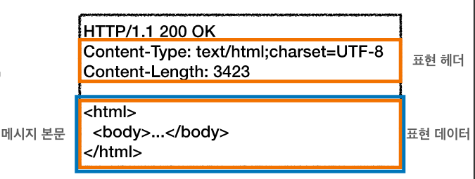

# 헤더

HTTP 전송에 필요한 모든 부가정보가 담겨있다.  
표준 헤더의 종류가 많고, 필요시 임의의 헤더를 추가 가능하다.  
 
- HTTP BODY(message body)  
]  
  - 메시지 본문(message body)을 통해 표현 데이터 전달
  - 메시지 본문 = 페이로드(payload)
  - 표현은 요청이나 응답에서 전달할 실제 데이터
  - 표현 헤더는 표현 데이터를 해석할 수 있는 정보 제공
  - 데이터 유형(html, json), 데이터 길이, 압축 정보 등등
  - 참고: 표현 헤더는 표현 메타데이터와, 페이로드 메시지를 구분해야 하지만, 여기서는 생략

## 표현 헤더
- Content-Type: 표현 데이터의 형식
  - 미디어 타입, 문자 인코딩과 관련된 조건

- Content-Encoding: 표현 데이터의 압축 방식
  - 표현 데이터를 압축할 때 사용
  - 데이터를 전달하는 곳에서 압축 후 인코딩 헤더 추가
  - 데이터를 읽는 쪽에서 인코딩 헤더의 정보로 압축해제

- Content-Language: 표현 데이터의 자연 언어
  - 표현 데이터의 언어를 표현
  - ko, en, en-US

- Content-Length: 표현 데이터의 길이
  - 바이트 단위

- 표현 헤더는 전송, 응답 둘다 사용

## 협상 헤더
클라가 선호하는 표현 요청  

- Accept: 클라이언트가 선호하는 미디어 타입 전달

- Accept-Charset: 클라이언트가 선호하는 문자 인코딩

- Accept-Encoding: 클라이언트가 선호하는 압축 인코딩

- Accept-Language: 클라이언트가 선호하는 자연 언어

- 협상 헤더는 요청시에만 사용

## 협상 자세한개념 + 전송방식 + 일반정보와 특별한 정보+ 인증 은 후에 자세히 공부하기
[미완성]

