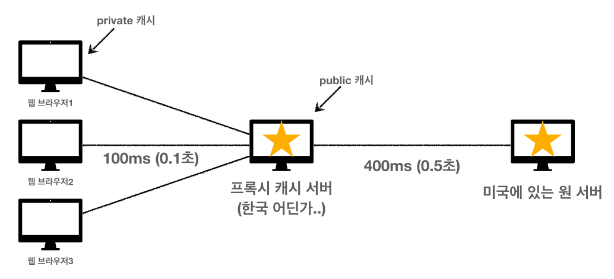

# 쿠키
HTTP는 기본적으로 무상태 프로토콜이다.  
클라와 서버가 응답을 한번 주고받으면 연결이 끊어진다.  
그래서 로그인 상태를 유지하기위해 쿠키 저장소 라는 개념을 도입했다.  

서버가 로그인이 확인되면 Set-Cookie 라는 헤더를 하나 만들고 거기에 클라의 정보를 담는다.  

이 Set-Cookie를 쿠키 저장소에 저장한다.  
로그인 이후에 클라가 다시 접속하면 서버는 쿠키저장소에서 클라와 일치하는 정보가 있는지 찾아보고 자동으로 클라의 요청때 마다 Cookie를 붙여서 서버로 보낸다.  

하지만 이렇게 모든 요청에 쿠키를 보내면 보안상 문제가 생기고 네트워크 트레픽이 올라간다.  
 

## 쿠키의 생명주기
Set-Cookie 헤더에서 쿠키의 만료일을 설정할 수 있다.  
세션 쿠키 : 만료날짜를 생략하면 브라우저 종료시까지 유지  
영속 쿠키 : 만료날짜를 입력하면 해당 날짜까지 유지
 

## 쿠키-도메인
도메인을 명시하면 그 도메인의 하위도메인에서도 모두 쿠키에 접근할 수 있고  
모데인을 샹랙하면 문서 기준 도메인만 쿠키에 접근할 수 있다.  
ex) domain=example.org -> exapmle.org , dev.example.org 모두 쿠키에 접근가능  
 

## 쿠키-경로
경로를 지정하면 경로를 포함한 하위경로 페이지만 쿠키에 접근  
일반적으로 path=/ 루트로 지정  
 

## 쿠키-보안
- Secure
  - https 인 경우에만 쿠키 전송
- HttpOnly
  - XSS 공격 방지
  - 자바스크립트에서 접근 불가
  - HTTP 전송에만 사용
- SameSite
  - XSRF 공격방지
  - 요청 도메인과 쿠키에 설정된 도메인이 같은 경우에만 쿠키 전송

 

# 캐시
만약 캐시가 없다면? 클라가 똑같은 요청을 반복해도 매 요청마다 서버가 반응을 보내고 클라는 매번 다운로드 받아야한다.  

만약 HTTP 헤더에 cache-control:max-age-60 로 60초짜리 캐시를 준다면 ?

웹브라우저의 브라우저캐시 저장공간에 캐시를 저장한다.  
두번째 요청부터는 브라우저캐시 안의 캐시의 수명이 남아있다면 중복요청하지않고 캐시안에서 바로 가져온다.  

60초가 지난 후 다시 요청을 한다면 서버에 다시 요청을 해야하고 그럼 또 시간과 트레픽이 생긴다...  
 

## 캐시 시간초과
캐시 유효시간이 초과하면 서버에 다시 요청할때 두가지 상황이 나타난다.  
1. 서버의 기존 데이터가 바뀐경우
2. 서버에서 기존 데이터가 그대로인 경우

1번은 문제가 없지만, 2번은 똑같은 데이터를 또 다운받을 필요가 없다.  

그렇다면 서버의 데이터가 브라우저 캐시보관함의 데이터와 같다는건 어떻게 판별할 수 있을까?  
 

## 검증헤더  

이떄 사용하는것이 **검증 헤더** 다.  

검증헤더 Last-Modifted 에 최종수정시각을 기록해둔다.  

브라우저캐시 내부의 검증헤더를 서버에 보내서 서버 데이터와 검증헤더 값이 똑같다면,  서버가 HTTP Body가 없는, 검증헤더가 담긴 HTTP header만 전송한다. 그럼 용량도 시간도 모두 절약된다.  
 

## Last-Modified + ETag
- Last-Modified , ETag
- 조건부 요청 헤더 
  - 검증 헤더로 조건에 따른 분기
  - If-Modified-Since: Last-Modified 사용
  - If-None-Match: ETag 사용
  - 조건이 만족하면 200 OK
  - 조건이 만족하지 않으면 304 Not Modified
 

## ETag(Entity Tag)
- 캐시용 데이터에 임의의 고유한 버전 이름을 달아둠
  - 예) ETag: "v1.0", ETag: "a2jiodwjekjl3"
- 데이터가 변경되면 이 이름을 바꾸어서 변경함(Hash를 다시 생성)
  - 예) ETag: "aaaaa" -> ETag: "bbbbb"
- 진짜 단순하게 ETag만 보내서 같으면 유지, 다르면 다시 받기!
 

## 캐시 제어 헤더
캐시 지시어(directives)
- Cache-Control: max-age
  - 캐시 유효 시간, 초 단위
- Cache-Control: no-cache
  - 데이터는 캐시해도 되지만, 항상 원(origin) 서버에 검증하고 사용
- Cache-Control: no-store
  - 데이터에 민감한 정보가 있으므로 저장하면 안됨  
  (메모리에서 사용하고 최대한 빨리 삭제)
- Pragma와 Expires도 있지만 캐시 컨트롤의 하위호환으로 잘 사용하지 않는다.  
 

## 프록시 캐시
원서버와 클라간의 거리가 멀고 시간이 오래걸린다면, 중간에 프록시 캐시서버를 하나 만들고 거기에 미리 캐시를 저장해두고 중간다리 역할을 하도록 한다.   
  

캐시 지시어(directives)
- Cache-Control: public 
  - 응답이 public 캐시에 저장되어도 됨

- Cache-Control: private 
  - 응답이 해당 사용자만을 위한 것임, private 캐시에 저장해야 함(기본값)

- Cache-Control: s-maxage 
  - 프록시 캐시에만 적용되는 max-age

- Age: 60 (HTTP 헤더)
  - 오리진 서버에서 응답 후 프록시 캐시 내에 머문 시간(초)

 

## 캐시 무효화
절대로 캐시가 되면 안되는곳에는 아래 세가지를 모두 입력해야 한다.
- Cache-Control: no-cache 
  - 데이터는 캐시해도 되지만, 항상 원 서버에 검증하고 사용(이름에 주의!)

- Cache-Control: no-store 
  - 데이터에 민감한 정보가 있으므로 저장하면 안됨  
  (메모리에서 사용하고 최대한 빨리 삭제)

- Cache-Control: must-revalidate 
  - 캐시 만료후 최초 조회시 원 서버에 검증해야함
  - 원 서버 접근 실패시 반드시 오류가 발생해야함 - 504(Gateway Timeout)
  - must-revalidate는 캐시 유효 시간이라면 캐시를 사용함

- Pragma: no-cache 
  - HTTP 1.0 하위 호환

