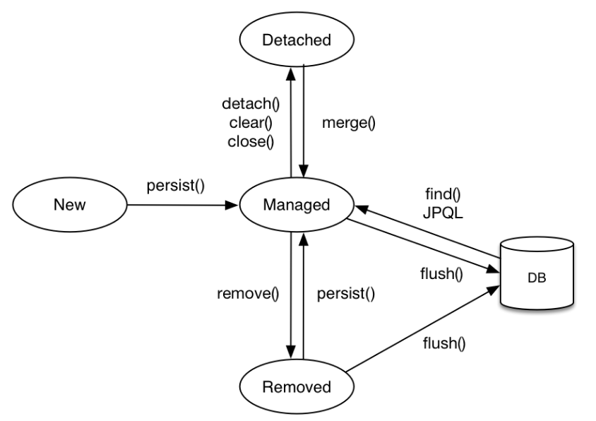

# JPA (Java Persistence API)
스프링은 DB와 데이터를 주고받는 까다로운 규칙이 있다.  

그래서 서버가 DB와 통신하려면 스프링의 규칙도 지키고 SQL도 작성해야하는 번거로움이 있다.

가장 큰 문제는 객체지향적인 자바코드를 SQL로 변환하는 것이다.  

DB의 데이터는 객체라는 개념이 없이 테이블형태로 들어가 있기 때문에 자바에서 객체를 다루듯 데이터를 조회,수정,입력 한다면 DB에서 원하는 결과를 얻기 힘들다.  

이때 서버와 DB사이에서 통역역할을 하는것이 JPA다.  

서버가 DB와 연결할때 개발자가 작성한 자바 코드를 JPA가 자동으로 SQL로 바꿔서 DB에 보내준다.  

때문에 개발자는 하나의 코드만 작성해도 DB가 변경되어도 다시 쿼리문을 작성할 필요가 없어진다.  

<br>

## 영속성 (Persistence)
객체지향과 DB의 차이를 극복하기 위해 영속성 개념을 이용한다.  
```
차이점이 무엇이길래 극복하는걸까?

예를들어

DB에 들어있는 Bong 이라는 데이터를 수정하려면 
DB에서 Bong을 조회하고 수정해서 다시 넣는다.
(or 지우고 새로운 데이터를 넣는다)

하지만 JPA를 사용하면 꺼낼 필요없이
DB에서 데이터를 찾고 수정하기만 하면 데이터가 바로 변경된다.

마치 Array에서 값을 꺼내지 않고 바로 수정할 수 있는것과 같은
효과를 적용할 수 있는것이다.
```

이렇게 **"객체형태가 아닌 DB의 데이터를 마치 객체 다루듯"** 

할 수 있는 이유가 JPA의 영속성 때문이다.  

- 영속 컨테스트(entityManager)  
영속 컨테스트 내부에 1차 캐시가 존재해서 데이터를 임시 저장하지만, 한 번의 트랜잭션에서만 유지되는 아주 짧은 캐시라서 성능에는 큰 영향을 미치지 않는다.  

- 영속 엔티티의 동일성 보장  
**같은 트랜잭션 안에서** 캐시가 유지되기 때문에 한 트랜잭션에서 이미 저장된 객체를 다시 조회하거나 사용할 때 같은 객체를 사용하는 것과 같다. (자바에서 같은 참조값을 가지는 두 변수는 결국 같은 값을 가리키는것과 동일하다)   

이 동일성 때문에 동일한 데이터(객체)를 여러번 조회하더라도 commit 하기 전에는 1차캐시 내부에 저장된 동일한 객체를 계속 사용한다. 

(내부에서 DB와 1차캐시 데이터를 비교할때 스냅샷 이라는 개념을 활용하고 플러시가 발생해서 DB에 쿼리를 보내는 과정도 있지만, 큰 그림을 파악하는것이 중요하다.)  

즉, commit 하기 전에는 SQL을 DB에 보내지 않고 commit 까지 기다리기 때문에 **"버퍼링"** 효과가 있다. (버퍼링은 평소에 동영상 버퍼링 걸렸다,영상이 멈췄다는 의미로 사용된다.)    
<br>

## 그럼 버퍼링을 사용하는 이유가 무엇일까?  

작업을 여러번 하는것 보다 버퍼라는 단위로 묶어서 한번에 보내는것이 효율적이다.  
```
DB에 Bong 이라는 데이터를 넣고싶다면
B 보내고 o 보내고 n 보내고 g 보낸다
만약 실수로 g 대신 m을 보냈다면?
BD에서 m을 지우고 g를 다시넣어야 한다.
이때 최소한 두번이상의 쿼리를 DB로 보내야 한다.

하지만 버퍼라는 임시공간에 B,o,n,g를 저장해두고 한번에 DB에 보낸다면
실수로 g 대신 n을 적었어도 임시공간에서 m만 수정하면 되고
수정된 버퍼를 한번에 commit (DB로 전송) 하면 끝이다.
한번의 쿼리로 DB에 저장할 수 있다.
```

## 엔티티 생명주기
  
영속화 : 테이터가 영속성 컨테스트 내부에 저장되는것  
비영속 : 데이터가 아직 영속화 되지 않은 상태  
준영속 : 영속화된 데이터를 잠시 영속성컨테스트 내부에서 불리시키는 것  
삭제 : 실제 DB에서 제거한 상태  

이처럼 데이터가 영속화되고 DB에 올라가거나 삭제되는 생명주기를 엔티티 생명주기라고 한다.  

DB와의  트랜잭션의 주기와 엔티티의 생명주기를 맞게 설계하는것이다.  
<br><br>

## 엔티티 매핑
- 테이블 : @Entity, @Table
- 필드,컬럼 : @Colunm
- PK : @Id
- 연관관계 : @ManyToOne, @OneToMany  


매핑은 JPA의 필드와 DB의 칼럼을 연결한다고 생각하면 쉽다.  
**"@Entity 가 붙은 클래스는 JPA가 관리하고, 엔티티"** 라고 부른다.  
**기본 생성자가 반드시 필요** 하고 final, enum, inner, interface 클래스는 사용할 수 없다.  
(DB에 저장하고싶은 필드에는 final 사용할 수 없다.)  

Default로 클래스 이름을 엔티티 이름으로 DB에 저장하지만,  
name 속성을 사용해 원하는 이름으로 DB에 저장할 수 있다.  

<br>

만약 매핑할 테이블 이름을 지정하려면  
@Table(name = 원하는이름) 식으로 사용할 수 있다.
```
만약 @Table(name = BONG) 식으로 작성하면
쿼리문이 나갈때 ~~ from BONG 식으로 작동한다.
```
<br>

## DB 스키마 자동생성
JPA에서는 어플리케이션 로딩시점에 DB 테이블을 생성하는 기능을 지원해준다.(로컬환경에서 개발할때 편리하지만 운영서버에서는 절대 사용하지 않는다)  
```
DB 테이블을 생성한다는 뜻은
기존에 존재하지 않는 필드에 값을 넣으면
오류가 뜨는게아니라 해당 필드를 DB에서 자동으로 생성하고 값을 넣어준다.  

create : 기존 테이블 삭제 후 다시 생성 (DROP + CREATE)
create-drop : create 후 종료시점에 테이블 DROP
update : 변경된 부분만 적용
validate : 엔티티와 테이블이 정상 매핑되었는지 여부 확인
none : 사용하지 않음
(단, 이 설정들은 운영DB에 사용하면 큰일남-> 운영DB 날라감)

// 이 설정들은 resource폴더 내부에서 적용시킨다
```

<br>


## 기본 키 매핑 (Primary Key)
- 직접 할당: @Id만 사용  

- 자동 생성(@GeneratedValue) 
  - IDENTITY: 데이터베이스에 위임, MYSQL 
  - SEQUENCE: 데이터베이스 시퀀스 오브젝트 사용, ORACLE 
    - @SequenceGenerator 필요 
  - TABLE: 키 생성용 테이블 사용, 모든 DB에서 사용 
    - @TableGenerator 필요 
    - 하지만 운영에서는 TABLE MAPPING을 사용하는것이 힘듦
  - AUTO: 방언에 따라 자동 지정, 기본값

기본 키를 정할때 중요한점은 null이 아니고 변하면 안된다는 것이다.  
하지만 운영상 다양한 이유로 키를 변경해야하는 경우가 생긴다.  

```
PK를 주민번호로 해두고 다른 테이블에서도 이 PK를 FK로 받고있는 DB구조가 잡혀있다.
그런데 운영상의 이유로 주민번호를 지워야한다면 ? 
PK만 바꾸면 되는게 아니라 이 PK를 FK로 받고있는 모든 테이블을 일일이 다 수정해야하는 최악의 경우가 생긴다 
```
<br>

그래서 일반적으로 자연키 값을 대체하는 대체키를 사용한다.  
대체키는 Long형 + 대체키 + 키 생성전략 을 사용하는것이 좋다.  
