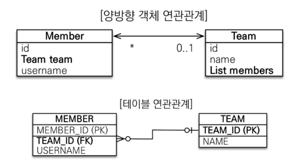

# 연관관계 매핑
테이블은 FK로 연관된 테이블을 찾고  
객체는 참조를 사용해서 연관된 객체를 찾기 때문에  
두 방식을 효과적으로 다루기 위해 연관관계 매핑이 필요하다.

## 양방향 매핑
단방향 매핑은 말 그대로 하나의 테이블에서 다른테이블을 조회할 순 있으므로 매핑이 복잡하지 않다.  

양방향 매핑도 연관관계의 두 테이블의 PK, FK를 Join하면 쉽게 관계를 확인할 수 있다.  

하지만 객체 관점에서는 복잡하다.  

```
이미지에서 하나의 Team에 여러명의 Member 가 있다.

DB 테이블에서는 TEAM_ID 라는 하나의 FK로 두개 모두 조회할 수 있다.


하지만 객체의 연관관계에서는 다르다.

Team 입장에서는 id, name 두가지 변수만 가지고 있고 어떤 Member들이 자기를 참조하고 있는지 알 방법이 없다.

그래서 이미지처럼 Team 은 Listmembers 라는 새로운 리스트를 가지고 있어야 한다.
```
<br>

그래서 mappedBy로 team의 Listmember와 Member의 team을 매핑하면 양방향 연관관계가 성립되고 서로를 조회할 수 있다.   
```Java
@Entity
public class Member { 
    @Id @GeneratedValue
    private Long id;

    @Column(name = "USERNAME")
    private String name;

    @ManyToOne
    @JoinColumn(name = "TEAM_ID")
    private Team team;
}
```
```Java
@Entity
public class Team {
    @Id @GeneratedValue
    private Long id;

    private String name;

    // mappedBy 로 Member 클래스의 team 변수와 매핑한다
    @OneToMany(mappedBy = "team") 
    List<Member> members = new ArrayList<Member>();
} 
```
<br>

## mappedBy

양방향 연관관계는 사실 단방향 연관관계 2개가 있는것과 같다.

그리고 이 2개의 단방향 연관관계 중 주인이 될 관계를 정해야 한다.  

이 연관관계의 주인(Owner)만 외래 키를 관리할 수 있고  
(주인이 아닌쪽은 읽기만 가능)  

주인이 아닌 변수에서 mappedBy 속성으로 주인을 지정한다.  

<br>

위의 코드로 보면  

Member의 team은 주인 / Team의 Listmember는 주인이 아니다.  

즉 데이터를 조회하고 수정하고 등록하는 모든 과정은  

주인인 Member.team을 통해 가능하다.  


한마디로 **DB테이블 상에서 FK가 있는곳을 주인으로** 정하면 대부분의 설계상의 문제를 피할 수 있다.  
( == DB상 1:N 의 연관관계에서 N을 주인으로 하면 안전하다)  

<br>

실전에서 더 안전하게 하려면?  

**양쪽에 모두 값을 넣어주는것이 Best** 다.  
```
나중에 다시 공부하겠지만  

Member클래스의 새로운 메서드를 만들고 (changeTeam 같은)  
team.getMembers().add(this) 를 작성하여  
주인이 아닌 team 클래스의 Listmember에 자신을 넣음으로써  
(꼭 Member가 아니라 Team에 만들어도 되고 둘중 하나에만 만들어야 한다)

주인과 주인이 아닌곳에 데이터를 동시에 넣을 수 있다  
```

<br>

## 양방향 연관관계 주의점
주인에 값을 입력하지 않는 경우를 주의해야 한다.  
```Java
// 여기서는 Memer의 team이 연관관계의 주인이므로 member.team을 입력했다
Team team = new Team();
team.setName("TeamA");
em.persist(team);

Member member = new Member();
member.setName("member1");
member.setTeam(team)
 // 주인인 member.team에 위에서 만든 teamA를 입력하므로 정상적으로 DB에 update된다


// 하지만 만약 역방향(주인이 아닌 방향)만 연관관계 설정하면 DB에는 null이 들어간다
// team.getMembers().add(member); // 이렇게 넣으면 null...
em.persist(member);
```
<br>


추가로 양방향 관계 내부에서  

toString(), lombok, JSON 생성 라이브러리를 사용하면 무한 루프가 발생하기도 하지만   

이 문제는 컨트롤러에서 엔티티를 반환하지 않는다면 발생하지 않는 문제다. (엔티티는 Dto로 변환해서 컨트롤러에서 사용하기)  

<br><br>


## 그럼 처음 설계할때부터 양방향 연관관계를 써야할까 ? No.
<br>

처음 설계할때는 단방향 매핑만으로도 연관관계 매핑을 완료해야 한다.    

양방향 매핑관계는 단방향 매핑관계에서 역참조를 추가한것 뿐이기 때문에  

후에 JPQL에서 역방향으로 탐색할 일이 많을때 양방향 매핑을 추가하면 된다.  
<br>


# 연관관계 매핑시 고려사항
1. 다중성
2. 단방향,양방향
3. 연관관계 주인

이 세가지를 꼭 고려해야하고 1:N 과 N:1 , 양방향, 단방향 개념을 정확히 이해하는것이 중요하다.  

<br>

## 다대일 [N:1]
N(다수)가 연관관계의 주인이며 양방향, 단방향 위에서 살펴본 코드처럼 간단하고 유용하다.  

<br>

## 일대다 [1:N]
1에서 외래키(FK)를 관리하는 방식이지만, 일대다의 경우는 실무에서 다양한 문제점들이 발생할 수 있다.

엔티티가 관리하는 외래키가 다른 테이블에 있기 때문에 연관관계 관리를 위해 추가로 UPDATE SQL이 실행된다.  

결론은 **1:N 보다 N:1 양방향으로 설계** 하는게 좋다.  

<br>

## 일대일 [1:1]

일대일은 외래키를 아무곳에나 넣고 주인으로 설정할 수 있다.  

일반적으로 주로 사용하는 테이블에 외래키를 넣는것이 편하다.

단, 외래키에 DB유니크(NNI) 제약조건이 추가되어야 한다.  

N:1 단방향 매핑과 거의 비슷하고 연관관계 중 가장 간단하다.  

## 다대다 [N:M]

우선 실무에서 쓰지않는것이 좋기때문에 이 내용은 후에 궁금할때 다시 찾아보도록 하자.  


