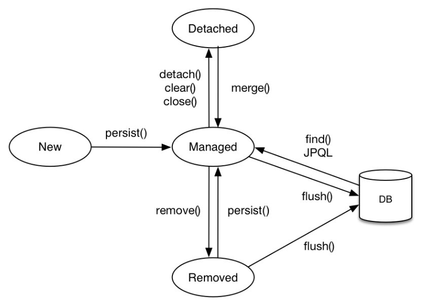

## 엔티티 생명주기
  
영속화 : 테이터가 영속성 컨테스트 내부에 저장되는것  
비영속 : 데이터가 아직 영속화 되지 않은 상태  
준영속 : 영속화된 데이터를 잠시 영속성컨테스트 내부에서 불리시키는 것  
삭제 : 실제 DB에서 제거한 상태  

이처럼 데이터가 영속화되고 DB에 올라가거나 삭제되는 생명주기를 엔티티 생명주기라고 한다.  

DB와의  트랜잭션의 주기와 엔티티의 생명주기를 맞게 설계하는것이다.  
<br><br>

## 엔티티 매핑
- 테이블 : @Entity, @Table
- 필드,컬럼 : @Colunm
- PK : @Id
- 연관관계 : @ManyToOne, @OneToMany  


매핑은 JPA의 필드와 DB의 칼럼을 연결한다고 생각하면 쉽다.  
**"@Entity 가 붙은 클래스는 JPA가 관리하고, 엔티티"** 라고 부른다.  
**기본 생성자가 반드시 필요** 하고 final, enum, inner, interface 클래스는 사용할 수 없다.  
(DB에 저장하고싶은 필드에는 final 사용할 수 없다.)  

Default로 클래스 이름을 엔티티 이름으로 DB에 저장하지만,  
name 속성을 사용해 원하는 이름으로 DB에 저장할 수 있다.  

<br>

만약 매핑할 테이블 이름을 지정하려면  
@Table(name = 원하는이름) 식으로 사용할 수 있다.
```
만약 @Table(name = BONG) 식으로 작성하면
쿼리문이 나갈때 ~~ from BONG 식으로 작동한다.
```
<br>

## DB 스키마 자동생성
JPA에서는 어플리케이션 로딩시점에 DB 테이블을 생성하는 기능을 지원해준다.(로컬환경에서 개발할때 편리하지만 운영서버에서는 절대 사용하지 않는다)  
```
DB 테이블을 생성한다는 뜻은
기존에 존재하지 않는 필드에 값을 넣으면
오류가 뜨는게아니라 해당 필드를 DB에서 자동으로 생성하고 값을 넣어준다.  

create : 기존 테이블 삭제 후 다시 생성 (DROP + CREATE)
create-drop : create 후 종료시점에 테이블 DROP
update : 변경된 부분만 적용
validate : 엔티티와 테이블이 정상 매핑되었는지 여부 확인
none : 사용하지 않음
(단, 이 설정들은 운영DB에 사용하면 큰일남-> 운영DB 날라감)

// 이 설정들은 resource폴더 내부에서 적용시킨다
```

<br>


## 기본 키 매핑 (Primary Key)
- 직접 할당: @Id만 사용  

- 자동 생성(@GeneratedValue) 
  - IDENTITY: 데이터베이스에 위임, MYSQL 
  - SEQUENCE: 데이터베이스 시퀀스 오브젝트 사용, ORACLE 
    - @SequenceGenerator 필요 
  - TABLE: 키 생성용 테이블 사용, 모든 DB에서 사용 
    - @TableGenerator 필요 
    - 하지만 운영에서는 TABLE MAPPING을 사용하는것이 힘듦
  - AUTO: 방언에 따라 자동 지정, 기본값

기본 키를 정할때 중요한점은 null이 아니고 변하면 안된다는 것이다.  
하지만 운영상 다양한 이유로 키를 변경해야하는 경우가 생긴다.  

```
PK를 주민번호로 해두고 다른 테이블에서도 이 PK를 FK로 받고있는 DB구조가 잡혀있다.
그런데 운영상의 이유로 주민번호를 지워야한다면 ? 
PK만 바꾸면 되는게 아니라 이 PK를 FK로 받고있는 모든 테이블을 일일이 다 수정해야하는 최악의 경우가 생긴다 
```
<br>

그래서 일반적으로 자연키 값을 대체하는 대체키를 사용한다.  
대체키는 Long형 + 대체키 + 키 생성전략 을 사용하는것이 좋다.  


