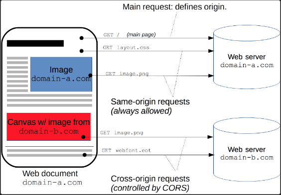

# :arrow_forward: XSS, CSRF
XSS 는 클라이언트를 , CSRF 는 서버를 공격한다.


XSS 는 사용자의 입력값을 제대로 검사하지 않을경우 발생한다.
만약 공격자가 올린 악성코드가 들어있는 게시글을 다른 사용자가 읽게되면 쿠키나 세션토큰 정보를 탈취당하고 시스템 자체도 공격할 수 있다.
인증된 세션이 없어도 공격가능하고, 자바스크립트를 실행시키는 방식으로 작동한다.

XSS를 방지하려면 쿠키에 중요한 정보를 담지않고 , 서버에 정보를 저장하면 된다.
혹은 정보를 암호화하고 httponly 속성으로 쿠키에 접속하는것을 막거나, 
인코딩을 사용하여 공격자가 입력해둔 값들을 무효화시키는 방법이 있다.


 CSRF 는 사용자가 로그인상태에서 위조공격코드가 삽입된 페이지를 열면, 그 사용자가 서버에게 신용받고있는 점을 이용하여 서버에 공격명령을 내린다.
인증된 세션을 악용하여 특정 행동을 강제로 시키는 공격이다.

CSRF는 백엔드에서 request의 referrer을 확인하여 domain정보가 일치하는지 검증하여 막을 수 있다.
Reffer검증이 불가능할때 Security Token을 사용할 수 있다. 사용자의 세션에 임의의 난수값을 저장해서, 사용자의 요청마다 난수값을 포함해서 전송한다. 그럼 백엔드에서 토큰값(난수+데이터)가 일치하는지 검증하면 공격을 막을 수 있다. 

<br>


# Call by value와 Call by reference

## :arrow_forward: call by value : 값에 의한 호출

함수가 호출될 때, 메모리 공간 안에서는 함수를 위한 별도의 임시공간이 생성됨 (종료 시 해당 공간 사라짐)

call by value 호출 방식은 함수 호출 시 전달되는 **"변수 값을 복사해서 함수 인자로 전달"**

이때 복사된 인자는 함수 안에서 지역적으로 사용되기 때문에 local value 속성을 가짐

함수 안에서 인자 값이 변경되더라도, 외부 변수 값은 변경안됨

```Java
public static void main(String[] args) {
    int a = 1;
    int b = 1;
    callByValue(a,b);
    System.out.println("a :" + a ); // a : 1
    System.out.println("b :" + b ); // b : 1
}
static void callByValue(int x, int y) {
    x = x + 1;
    y = y + 1;
    System.out.println("x :" + x );  // x : 2
    System.out.println("y :" + y );  // y : 2
}
```
callByValue(a,b)를 할때 매개변수 a,b에 실제 a,b를 넣는게아니라 a,b의 복제된 값을 넣는다.  
그러므로 실제 메서드 내부에서 사용되는 a,b는 이름과 가진 값만 같을뿐 다른 공간에 있는 변수다.  
결국 메서내 내부에서 아무리 바뀌더라도 본래의 a,b에는 영향이 없다

<Br>

## :arrow_forward: call by reference : 참조에 의한 호출

call by reference 호출 방식은 함수 호출 시 인자로 전달되는 변수의 레퍼런스(주소 값)을 전달

따라서 함수 안에서 인자 값이 변경되면, 아규먼트로 전달된 객체의 값도 변경됨
(주소를 찾아가서 인자 자체를 변경시킴)

```Java
void func(int *a) {
    *a = 20;
}

void main() {
    int b = 10;
    func(&b);
    printf("%d", b); # 20
}
```
처음에 b는 10을 가지고있다. 하지만 위의 func()메서드에 들어가면 b는 메모리상의 20의 주소값(레퍼런스)을 가지게 된다. 그러므로 b를 print하면 20의 주소값을 가지고 있으므로 20이 출력된다. 
이때 주소값(레퍼런스)를 바로 넘겨받는다고하여 call by reference라고 한다.

<br>


## :arrow_forward: Java 함수 호출 방식

자바의 경우, 항상 call by value로 값을 넘긴다.
일반 자료형의 경우 위에서 살펴본 예시와 동일하게 작동한다.

reference type(참조 자료형)은 조금 다르지만 동일하게 call by value로 값을 넘긴다.  
기존의 call by reference가 주소값을 바로 넘겨주는것과 다르게 객체의 **주소값을 복사**하여 넘겨준다.  
주소값을 복사한다는건 값을 복사한다는 call by value와 같은 의미이므로 자바에서 참조자료형의 호출은 call by value가 되는 것이다.  

<br>


# CORS
교차 출처 리소스 공유(Cross-Origin Resource Sharing, CORS)는 추가 HTTP 헤더를 사용하여, 한 출처에서 실행 중인 웹 애플리케이션이 다른 출처의 선택한 자원에 접근할 수 있는 권한을 부여하도록 브라우저에 알려주는 체제다.  

반대로 이 CORS를 못하게 막고있는것이 SOP(Same-Origin Policy)다. 이것은 같은 출처에서만 API가 작동할 수 있도록 하는 체제다.  

기본적으로 브라우저에서는 SOP가 기본값으로 되어있지만, 웹 생태계가 다양해지면서 다른사이트 간의 요청을 가능하게 하도록 허용해주는것이 바로 CORS 다.  

백엔드에서 CORS를 허용할 사이트목록을 적어놓으면 허용한 사이트에 한해서만 작동한다.  

상대적으로 서버에 영향을 주지않는 GET,POST 보다 PUT, DELETE같이 변경을 가하는 경우가 더 엄격한 CORS 기준을 가지고 있다.  

[위키백과 CORS](https://developer.mozilla.org/ko/docs/Web/HTTP/CORS)  

  


# :arrow_forward: JPA 공부 접근방식

1. 인프런강의
2. 패캠강의
3. 실습페이지만들기
4. 

  


