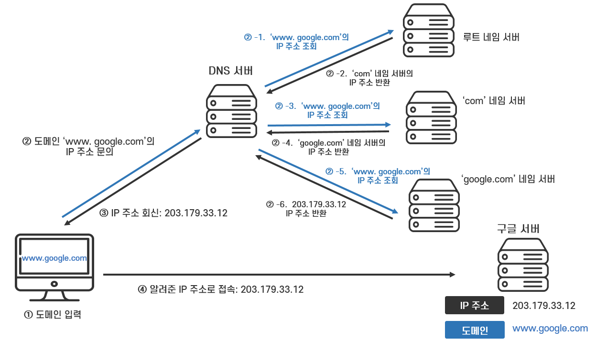

## JPA(Java Persistence API)
스프링은 db와 데이터를 주고받는 규칙이 있다.  
서버개발자는 스프링의 규칙에 맞는 코드를 작성하고  
만약 여러종류의 DB를 사용한다면 SQL도 여러개 작성해야한다.  
한마디로 일을 두 번 해야한다.  

이때 서버와 데이터베이스간의 연결(통역)역할을 하는것이 JPA 다.    
JPA가 코드를 SQL로 변환해주기 때문에 개발자가 SQL을 작성할 필요가 없어진다

즉, JPA가 서버와 db간의 독립적인 설계를 가능하게 하고 이것이 객체중심 개발의 기초가 된다

ORM (Object-Relational Mapping)은 객체(서버의 데이터들)과 Relational(관계형데이터베이스)를 연결해주는 것을 뜻한다.

Java의 ORM기술 표준이 JPA인 이유가 바로 JPA가 하는 역할이 정확히 ORM의 정의와 일치하기 때문이다. 

<br>


## 스프링의 구조
1. Controller : 가장 바깥 부분, 요청/응답을 자동으로 처리함(자동응답기)  
request 받기 + response 보내기  
        
2. Service : 중간 부분, 실제 중요한 작동이 많이 일어나는 부분(Update 는 Service 부분에 작성)  
repo에게 할 역할을 시키는부분  
(request받은 Dto로 DB에 저장할 객체 만들기)  
(DB에 상품이 존재하는지 확인시키기)  
현업에서는 service의 역할이 가장 크다  
    
3. Repository : 가장 안쪽 부분, DB와 맞닿아 있음(쿼리를 날리는 역할)  
JPA는 Repository(인터페이스)를 통해서만 사용할 수 있다  
( 인터페이스 : 맴버변수가없는 메소드모음집)  
(서비스에서 시킨 DB연결, DB쿼리작성, DB쿼리실행, 쿼리결과물 객체를 반환, DB연결해제)  

<br><br>
 
## Put, Patch
기존 API의 주요기능인 CRUD 중 Update에 사용되는 RestfulAPI의 기능이다
Put : 데이터의 전체를 수정할때 사용
Patch : 데이터의 부분만 수정할때 사용

<br><br>

## RDBMS
관계형 데이터베이스 (고도화된 엑셀이다)  


## H2
서버가 작동할때만 작동하는 데이터베이스, 초기 DB연습에 최적화되어있다  


## MYSQL
서비스를 배포할떄 사용하는 데이터베이스  
AWS의 RDS서비스를 사용하여 Spring과 연결  


## 데이터의 생성일자
데이터의 생성일자와 수정일자를 기록하는게 중요하다  


## Lombok
코드를 자동생성해주는 라이브러리

## DTO
데이터를 주고받을때 새로 클래스 만들어서 쓰자(기존의클래스 사용하지말자)


## API
클라 - 서버 간의 약속
클라가 Request -> 서버는 처리하여 Response

- REST : 생성POST / 조회GET / 수정PUT / 삭제DELETE
- 주소에 들어가는 명사는 복수형
- 주소에 동사는 가급적 사용하지않음

## ARC
Advanced REST Client
API의 테스트및 기능확인용 툴


## 컴포넌트 등록
스프링이 자동으로 필요한 클래스를 필요한곳에 생성하려면  
" 사용자가 요구하면 자동으로 생성할 클래스목록인가" 하고 확인할수 있어야하는데  
그 목록에 등록하는 간단한 방법이 컴포넌트 등록

## DI (의존성주입)

강한결합에는 문제점이 있다  
강한결합 : 하나의 컨트롤러가 하나의 서비스를 생성하고 그 서비스는 또 하나의 레포지토리를 생성하여 사용 (즉 컨트롤러가 여러개라면 서비스와 레포지토리를 매번 반복생성하여 여러개의 서비스와 레포지토리가 생성됨)  
만약 이미 생성된 레포지토리 형태를 바꿔야한다면? 컨트롤러와 컨트롤러 수 만큼 생성된 모든 레포지토리와 서비스를 모두 변경해주어야 한다.  


이 강한결합의 문제점을 극복하기 위해서는 두가지를 지켜야한다
1. 각 객체에대한 객체생성은 딱1번만한다
2. 생성된 객체를 모든곳에서 재사용한다

즉 생성과정을 반대로 시행한다  
1. 먼저 레포지토리 클래스를 선언하고 객체를 생성한다
2. 서비스클래스를 선언하고 맴버변수로 1번에서 이미 생성한 레포지토리객체를 재사용한다
3. 컨트롤러를 선언하고 맴버변수로 2번에서 이미 생성한 서비스객체를 재사용한다  


이렇게하면 처음에 생성된 레포지토리를 반복사용하기때문에, 레포지토리에 변경사항이 생겨도 다른 서비스와 컨트롤러의 코드를 일일이 수정해줄 필요가없어진다  
**이것을 느슨한 결합** 이라 한다  

그리고 이렇게 제어의 흐름이 반대로 바뀐것을  
**제어의 역전 IoC ( Inversion of Control )** 이라 하고  

즉 용도에맞게 이미 생성한 객체를 가져다 사용한다  
이것을 **의존성주입(DI)** 라고 한다  


## 팀과제


🔐 JPA 가 무엇인가요?  


🔐 Controller, Service, Repository 가 무엇인가요  


🔐 restAPI의 put 과 patch 는 어떤 차이점이 있을까요? 어떤 경우에 사용하면 좋을까요?  


🔐 우리가 브라우저에서 구매한 도메인 주소를 입력하면 만들어 놓은 aws EC2 서버까지 전달이 되어서 해당 서버에게 요청을 보낼 수 있습니다. 이 과정이 상세하게 어떻게 진행되는지 그림으로 한번 그려볼까요?

Hosting :  
웹 페이지를 제작할때 페이지 내용을 물리적으로 저장할 컴퓨터가 반드시 필요하다. 본인 컴퓨터나 AWS, AZURE, 구글 클라우드 등 서버 컴퓨터를 대여받아 이용하는데 이 대여받은 컴퓨터를 "호스팅 서버" 라고 부른다.  
즉 호스팅은 데이터를 저장하는 어떤 공간(호스팅서버)를 요청하는 과정이고, 호스팅된 하나의 호스팅서버를 "호스트"라 한다. 각각의 웹 호스팅 서버에는 특정 IP주소를 갖고 있다. 이 IP주소가 실제 웹브라우저의 주소다.  
우리가 실습하며 대여받은 aws EC2 서버가 하나의 호스트 이고 특정 IP주소를 가지고있다.  
그리고 그 호스트 안에는 우리가 저장시켜놓은 페이지 내용이 담겨있다.

Domain :  
웹 브라우저로 어떤 사이트에 접속할 때 페이지의 IP주소를 입력하면 들어갈 수 있다. 실습으로 비교해보면 나의 EC2서버의 IP주소를 입력하면 내가만든 홈페이지에 접속할 수 있다.  
하지만 IP주소는 3.35.44.19 처럼 숫자들로 이뤄져있기 때문에 기억하기 어렵다.  
이 IP주소를 대신해주는 알아보기 쉬운 숫자, 문자, 그리고 DOT(.)으로 만든 주소가 Domain이다. 우리 실습에서는 가비아에서 만든 bong.shop ~ 이 도메인 주소다.  

참고로 도메인주소는 이러한 구조로 되어있고(IPv4 기준) 도메인별로 다른 서버에서 관리한다.  
```
  www   .    naver    .    com       .  
3차 도메인   2차 도메인    1차 도메인  Root 도메인
```


DNS(도메인 이름 시스템) :
호스트의 도메인 주소를 IP주소로 바꾸거나 반대 작용을 한다. 이때 입력받은 도메인을 운영체제가 ip로 변환하는 과정을 도메인 해석 이라 한다.  
도메인해석과정을 거치면 원하는 페이지의 IP주소를 얻게되고 그 IP주소로 접속할 수 있게 된다.  


DNS 서버의 질의 과정(Recursive Query)


1. 사용자는 브라우저 주소창에 www.google.com을 입력한다. 특정 톤싱사의 DNS서버에게 www.google.com라는 도메인 주소의 IP를 질의(Recursive Query)한다. (KT 인터넷사용자는 KT ISP DNS Server에 요청)

 

2. ISP DNS Server가 요청을 받았지만 www.google.com에 대한 IP주소가 존재하지 않는다고 가정하면, IP주소를 알아내기 위해 Root DNS Server에게 질의한다. (캐시 데이터가 존재한다면 Domain에 해당하는 IP주소를 브라우저에게 응답)

 

3. Root DNS Server는 TLD DNS Server의 정보가 담겨있다. 그래서 ***.com의 도메인을 보고, COM 최상위 도메인을 관리하는 TLD DNS Server의 IP를 ISP DNS Server로 응답.(COM은 COM TDL 서버, NET은 NET TDL서버, ORG는 ORG TDL 서버)

 

4. ISP DNS Server는 다시 COM Server에게 어디로 가야하는지 질의한다.

 

5. COM 도메인을 관리하는 서버는 도메인/호스팅 업체의 네임서버(가비아, AWS Route 53)에서 관리되는걸 확인하고 다시 ISP DNS Server에게 전송한다.

 

6. ISP DNS Server는 도메인/호스팅 업체중 하나인 가비아 서버에게 질의한다.

 

7. 가비아 서버는 google.com = 223.130.195.200이라는 정보를 확인 후 해당 IP주소를 ISP DNS Server로 알려주고 ISP DNS Server는 해당 정보를 캐시로 기록한다.

 

8. ISP DNS Server는 드디어 브라우저에게 해당 도메인과 IP주소 www.google.com:223.130.195.200을 전달한다.

 

9. 브라우저는 google.com에 해당하는 IP주소를 받아 호스팅 서버에게 웹사이트를 출력하라고 요청한다.

 

10. 이제 네이버라는 화면이 보인다.


🔐 스프링 프레임워크는 어떤 특징 혹은 장점을 가지고 있나요? (3가지 이상)  


🔐 스프링에서 DI (의존성 주입) 를 사용하는 이유가 무엇인가요? 예를 통해 설명 해 보세요.  


🔐 스프링 시큐리티를 사용해 회원관리하는 방법을 순서도를 통해 정리해 보세요.  

🔐 개발자 테스트 코드 작성 시 장/단점과 테스트 종류 별 (단위 테스트, 통합 테스트, E2E 테스트) 로 특징은?  

🔐 ORM, JPA, Spring Data JPA 를 구분해서 설명해 보세요.  

🔐 Optional) 절차지향 프로그래밍, 객체지향 프로그래밍,  관점지향 프로그래밍은 각각 어떻게 다른가요? (각각 예제 1개 이상)  

