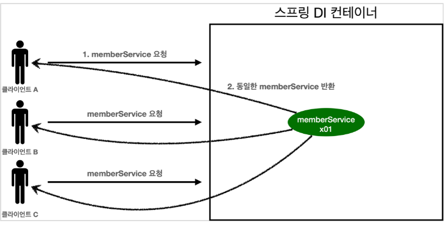

# 싱글톤 컨테이너
웹 어플리케이션은 보통 여러 사용자가 동시에 요청한다  
이때 스프링을 쓰지않은 DI 컨테이너로 요청을 처리한다면 요청하나에 객체하나를 생성하고 만명이 요청하면 객체를 만번 만들어서 엄청난 메모리낭비가 생긴다.  

이것을 해결하기위해 객체를 딱 하나만 생성하고, 공유하도록 설계하면 된다.  
이것이 싱글톤 패턴이다.  

<br>

## 싱글톤 패턴
클래스의 인스턴스가 딱 하나만 생성되는것을 보장하는 디자인패턴 이다.  
private 생성자를 사용해서 외부에서 new 하지못하도록 막는다.  

```Java
public class SingletoneService {
    
    // static 영역에 객체를 딱 하나만 생성
    private static final SingletoneService instance = new SingletoneService();
    
    // public 으로 열어서 객체 인스턴스가 필요하면 이 static 메서드를 통해서만 조회하도록 허용
    public static SingletoneService getInstance() {
        return instance;
    }
    
    // 생성자를 private으로 선언해서 외부에서 new 키워드로 생성하지 못하게 막는다
    private SingletoneService() {
    }
}
```

하지만 싱글톤패턴은 많은 문제점이 있다.  

- 싱글톤 패턴을 구현하는 코드가 많이 필요하다(위의 예시처럼 전부 설정해줘야 한다)
- 클라이언트가 구현체 클래스에 의존한다 -> DIP 위반하고 OCP 또한 위반할 가능성이 높다
- 테스트, 내부속성 변경, 자식클래스 만들기가 전부 어렵다
- 결국 유연하게 적용하기가 어려워서 **"안티패턴"** 으로 불리기도 한다


<br>

## 싱글톤 컨테이너
스프링 컨테이너가 이 싱글톤 문제를 해결하고, 객체 인스턴스를 싱글톤으로 관리한다.  
스프링 빈 이 바로 싱글톤으로 관리되는 빈 이다.  

스프링 컨테이너는 객체를 하나만 생성해서 관리해서 싱글톤 컨테이너 역할을 한다.  
이렇게 싱글톤 객체를 생성하고 관리하는 기능을 **싱글톤 레지스트리** 라 한다.  
스프링 컨테이너의 이런 기능 덕분에 싱글턴 패턴의 모든 단점을 해결하면서 객체를 싱글톤으로 유지할 수 있다.  
(DIP, OCP, 테스트 모두 자유롭고 private 생성자로부터 자유롭게 싱글톤을 사용할 수 있다)  


<br>

## 싱글톤 방식의 주의점
싱글톤은 하나의 객체를 재활용하므로, 객체가 상태를 저장해서는 안된다.  
한마디로 어떤 클라이언트에게도 의존하면 안되고 클라이언트는 읽기만 가능해야 한다.  
이런 상태를 무상태(stateless)라고 한다.  

 실제로 이런 코드가 싱글톤 방식의 문제를 발생시킨다.  
 공유필드를 무상태로 만드는것을 꼭 기억해야 한다.  
```Java
public class StProblem {

    private int price; // 공유 필드

    public void order(String name, int price) {
        System.out.println("Name = " + name + "Price = " + price);
        this.price = price; // 여기가 문제 
        // 매개변수로 들어온 price값을 기존의 price값에 저장해버린다
    }

    public int getPrice() {
        return price;
    }
}

public class test{
    ...

    stProblem1.order("A", 10000); // 쓰레드1 에서 A 사용자 만원 주문
    stProblem2.order("B", 20000); // 쓰레드2 에서 B 사용자 2만원 주문

    int price = stProblem1.getPrice(); // B사용자가 중간에 끼어버려서 2만원이 나옴
    // 같은 StProblem 객체를 쓰기 때문에 중간에 사용자B가 price값을 바꿔버리고 그대로 저장됨
}
```

<br>

## Configuration과 싱글톤
```Java
@Configuration 
public class AppConfig {

    @Bean 
    public MemberService memberService() { 
        // 내부에서 한번 
        System.out.println("call AppConfig.memberService"); 
        return new MemberServiceImpl(memberRepository()); 
    }
    @Bean 
    public OrderService orderService() { 
        // 내부에서 또 한번
        System.out.println("call AppConfig.orderService"); 
        return new OrderServiceImpl(memberRepository(), discountPolicy()); 
    }
    @Bean 
    public MemberRepository memberRepository() {
        // 여기서 bean에 등록하기위해 또 한번
        System.out.println("call AppConfig.memberRepository"); 
        return new MemoryMemberRepository(); 
    }
}
'''
출력결과
call AppConfig.memberService 
call AppConfig.memberRepository 
call AppConfig.orderService
'''
```
스프링컨테이너는 각각 @Bean을 호출해서 스프링 빈을 생성한다.  
이때 memberRepository()는 3번 호출 되는것 처럼 보인다.  
하지만 실제로 print된 내용을 보면 각각 1번씩 따로 호출된다 how??

<br>

## 이것을 가능하게 하는게 @Configuration의 역할이다
@Configuration이 적용된 클래스 내부에서는  
@Bean이 붙은 메서드마다 이미 같은 스프링빈이 존재한다면 이미 등록해놓은 그 빈을 반환하고, 스프링빈이 없다면 생성해서 등록하는 동적인 형태로 코드가 작성된다.  
그래서 동일한 요소를 반복해서 스프링빈으로 등록해도 실제로는 하나만 등록하여 사용하게되고 싱글톤이 보장된다.  
잘 이해가 되지 않는다면 ? 일단 스프링빈을 설정하는 위치에는 @Configuration을 넣어보자!

