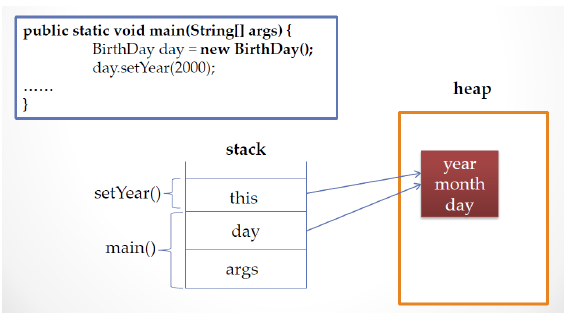

# OOP_2
## 참조자료형
- 변수의 자료형이며 클래스형으로 변수를 선언
- 기본 자료형은 사용하는 메모리의 크기가 정해져 있지만, 참조 자료형은 클래스에 따라 다름
- 참조 자료형을 사용 할때는 해당 변수에 대해 생성하여야 함  
(String 클래스는 예외적으로 생성하지 않고 사용할 수 있음)

## 접근 제어 지시자 (accesss modifier)
- 클래스 외부에서 클래스의 멤버 변수, 메서드, 생성자를 사용할 수 있는지 여부를 지정하는 키워드
- private : 같은 클래스 내부에서만 접근 가능 ( 외부 클래스, 상속 관계의 클래스에서도 접근 불가)
- 아무것도 없음 (default) : 같은 패키지 내부에서만 접근 가능 ( 상속 관계라도 패키지가 다르면 접근 불가)
- protected : 같은 패키지나 상속관계의 클래스에서 접근 가능하고 그 외 외부에서는 접근 할 수 없음
- public : 클래스의 외부 어디서나 접근 할 수 있음

### get()/ set() 메서드
- private 으로 선언된 멤버 변수 (필드)에 대해 접근, 수정할 수 있는 메서드를 public으로 제공
- get() 메서드만 제공 되는 경우 read-only 필드
- 이클립스에서 자동으로 생성됨 (source -> getter setter 생성선택)

### 정보 은닉
- private으로 제어한 멤버 변수도 public 메서드가 제공되면 접근 가능하지만 변수가 public으로 공개되었을 때보다 private 일때 각 변수에 대한 제한을 public 메서드에서 제어 할 수 있다
- 객체 지향 프로그램에서 정보 은닉은 필요한 외부에서 접근 가능한 최소한의 정보를 오픈함으로써 객체의 오류를 방지하 클라이언트 객체가 더 효율적으로 객체를 활용할 수 있도록 해준다

## 정보은닉을 활용한 캡슐화 (encapsulation)
- 외부에서 사용할 꼭 필요한 정보와 기능만 외부에 오픈
- 대부분의 **멤버 변수와 메서드를 감추고** 외부에 통합된 인터페이스만 제공하여 클라이언트가 사용하기 편한 일관된 기능을 구현하게 함
- 각각의 메서드나 멤버 변수를 접근함으로써 발생하는 오류를 최소화 한다
  - 디버깅이나 새로운 메서드의 추가가 원활
```JAVA
public class MakeReport {

	StringBuffer buffer = new StringBuffer();
	
	private String line = "===========================================\n";
	private String title = "  이름\t   주소 \t\t  전화번호  \n";
	private void makeHeader()
	{
		buffer.append(line);
		buffer.append(title);
		buffer.append(line);
	}
	
	private void generateBody()
	{
		buffer.append("James \t");
		buffer.append("Seoul Korea \t");
		buffer.append("010-2222-3333\n");
		
		buffer.append("Tomas \t");
		buffer.append("NewYork US \t");
		buffer.append("010-7777-0987\n");
	}
	
	private void makeFooter()
	{
		
		buffer.append(line);
	}
	
    // 외부(클라)에서 쓸수 있는 유일한 메서드
	public String getReport()
	{
		makeHeader();
		generateBody();
		makeFooter();
		return buffer.toString();
	}
}
```
```JAVA
public class TestReprt {

	public static void main(String[] args) {

		MakeReport builder = new MakeReport();
		String report = builder.getReport();
		
		System.out.println(report);
	}

}
```

## 객체 자신의 this
- 인스턴스 자신의 메모리를 가리킴
- 생성자에서 또 다른 생성자를 호출 할때 사용
- 자신의 주소(참조값)를 반환 함
- 생성된 인스턴스 메모리의 주소를 가짐
  - 클래스 내에서 참조변수가 가지는 주소 값과 동일 한 주소 값을 가지는 키워드

```JAVA
public void setYear(int year)
{
    this.year = year;
}
```

## 생성자에서 다른 생성자를 호출 하는 this
- 클래스에 생성자가 여러 개 인경우, this를 이용하여 생성자에서 다른 생성자를 호출할 수 있음
- 생성자에서 다른 생성자를 호출하는 경우, 인스턴스의 생성이 완전하지 않은 상태이므로 this() statement 이전에 다른 statement를 쓸 수 없음
```JAVA
public class Person {

	String name;
	int age;
	
	public Person() {
        // 이 공간에 다른 statement가 들어올 수 없다
		this("이름없음", 1); // 이 생성자로 아래의 Person 생성자를 호출
        // 이 공간에는 정상적으로 다른 statement 입력가능
    }
	
	public Person(String name, int age) {
		this.name = name;
		this.age = age;
	}
}
```