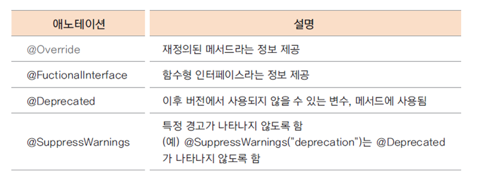

# 클래스 상속

## 상속을 구현 하는 경우
- 상위 클래스는 하위 클래스 보다 더 일반적인 개념과 기능을 가짐
- 하위 클래스는 상위 클래스 보다 더 구체적인 개념과 기능을 가짐
- 하위 클래스가 상위 클래스의 속성과 기능을 확장 (extends)한다는 의미
```
상속하는 클래스 : 상위 클래스, parent class, base class, super class

상속받는 클래스 : 하위 클래스, child class, derived class, subclass
```
```JAVA
// 상속클래스 생성 기본형태
class B extends A{}
 extends 키워드 뒤에는 단 하나의 클래스만 올 수 있음
 자바는 단일 상속(single inheritance)만을 지원함
```
<br><br>

## protected 접근 제어자
- 상위 클래스에 선언된 private 멤버 변수는 하위 클래스에서 접근 할 수 없음
- 외부 클래스는 접근 할 수 없지만, 하위 클래스는 접근 할 수 있도록 protected 접근 제어자를 사용
```JAVA
public class Customer{
	protected int customerID; // private은 상속받는 클래스에서 접근이 불가능하므로 protected 사용
    ...
}
```
<br><br>

## 하위 클래스가 생성 되는 과정
- 하위 클래스를 생성하면 상위 클래스가 먼저 생성 됨
- new VIPCustomer()를 호출하면 Customer()가 먼저 호출 됨
- 클래스가 상속 받은 경우 하위 클래스의 생성자에서는 반드시 상위 클래스의 생성자를 호출 함
- 이것이 가능한이유는 컴파일러가 자동으로 super()가 실행되기 때문
<br><br>

## super 키워드
- 하위 클래스에서 가지는 상위 클래스에 대한 참조 값
- super()는 상위 클래스의 기본 생성자를 호출 함
- 하위 클래스에서 명시적으로 상위 클래스의 생성자를 호출하지 않으면 super()가 호출 됨 (이때 반드시 상위 클래스의 기본 생성자가 존재 해야 함)
- 상위 클래스의 기본 생성자가 없는 경우 ( 다른 생성자가 있는 경우 ) 하위 클래스에서는 생성자에서는 super를 이용하여 명시적으로 상위 클래스의 생성자를 호출 함
- super는 생성된 상위 클래스 인스턴스의 참조 값을 가지므로 super를 이용하여 상위 클래스의 메서드나 멤버 변수에 접근할 수 있음
```JAVA
// 디폴트 생성자 없애고 매개 변수가 있는 생성자 추가
public Customer(int customerID, String customerName) {
		this.customerID = customerID;
		this.customerName = customerName;
		
		customerGrade = "SILVER";
		bonusRatio = 0.01;
		System.out.println("Customer(int, String) 생성자 호출");
}
```
```JAVA
// super를 이용하여 상위 클래스의 생성자 명시적으로 호출
public VIPCustomer(int customerID, String customerName) {
		super(customerID, customerName);
		
		customerGrade = "VIP";
		bonusRatio = 0.05;
		salesRatio = 0.1;
		
		System.out.println("VIPCustomer(int, String) 생성자 호출");
}
```
<br><br>

## 상속에서 인스턴스 메모리의 상태
- 항상 상위 클래스의 인스턴스가 먼저 생성되고, 하위 클래스의 인스턴스가 생성 됨

<br><br>

## 형변환(업캐스팅)
- 상위 클래스로 변수를 선언하고 하위 클래스의 생성자로 인스턴스를 생성
- 상위 클래스 타입의 변수에 하위 클래스 변수가 대입;
```JAVA
VIPCustomer vCustomer = new VIPCustomer();
addCustomer(vCustomer);
int addCustomer(Customer customer){
} // 한마디로 VIP로 만들었지만, Customer로 자동 형변환이 되서 들어간다
```
- 하위 클래스는 상위 클래스의 타입을 내포하고 있으므로 상위 클래스로의 묵시적 형 변환이 가능함
- 상속 관계에서 모든 하위 클래스는 상위 클래스로 형 변환(업캐스팅)이 되지만 그 역(다운캐스팅)은 성립하지 않음
<br><br>

## 메서드 재정의 (overring)
- 오버라이딩(overriding) : 상위 클래스에 정의된 메서드의 구현 내용이 하위 클래스에서 구현할 내용과 맞지 않는 경우 동일한 이름의 메서드를 하위클래스에서 재정의 하는것
```JAVA
@Override
// 상위클래스와 동일한 데피니션을 작성해야 오버라이딩된다
public int calcPrice(int price) { 
	bonusPoint += price * bonusRatio;
	return price - (int)(price * salesRatio);
}
```
- @overriding 어노테이션 (annotation)
  - 컴파일러에게 특별한 정보를 제공해주는 역할로 주석이라는 의미이다
  - @overriding 애노테이션은 재정의 된 메서드라는 의미로 선언부가 기존의 메서드와 다른 경우 에러발생
  

## 형 변환과 오버라이딩 메서드 호출
Customer vc = new VIPCustomer();  
이런식으로 형변환이 일어났을때 변수 vc의 타입은 Customer지만, 
인스턴스의 타입은 VIPCustomer이다. 자바의 모든 메서드는 가상 메서드(virtual method)이기 때문에 변수 vc에서 오버라이딩된 메서드를 실행하면 Customer가아닌 VIPCustomer의 메서드가 실행된다.

## 가상메서드(virtual method)란 ?
- 메서드(함수)의 이름은 주소값을 나타냄
- 메서드는 명령어의 set 이고 프로그램이 로드되면 메서드 영역(코드 영역)에 명령어 set이 위치
- 해당 메서드가 호출 되면 명령어 set 이 있는 주소를 찾아 명령어가 실행되고 이때 메서드에서 사용하는 변수들은 스택 메모리에 위치
- 서로다른 인스턴스는 변수값은 다르지만 메서드의 코드는 동일하므로 같은 메서드가 호출
- 인스턴스가 생성되면 변수는 힙 메모리에 따로 생성되지만, 메서드 명령어 set은 처음 한번만 로드
```JAVA
public class TestMethod {

	int num;
	
	void aaa() {
		System.out.println("aaa() 호출");
	}
	
	public static void main(String[] args) {
		
		TestMethod a1 = new TestMethod();
		a1.aaa();
		
		TestMethod a2 = new TestMethod();
		a2.aaa();
	}
}
```


## 가상메서드 원리
- 가상 메서드 테이블(vitual method table)에서 해당 메서드에 대한 address를 가지고 있음
- 재정의(오버라이딩)된 경우는 재정의 된 메서드의 주소를 가리킴
